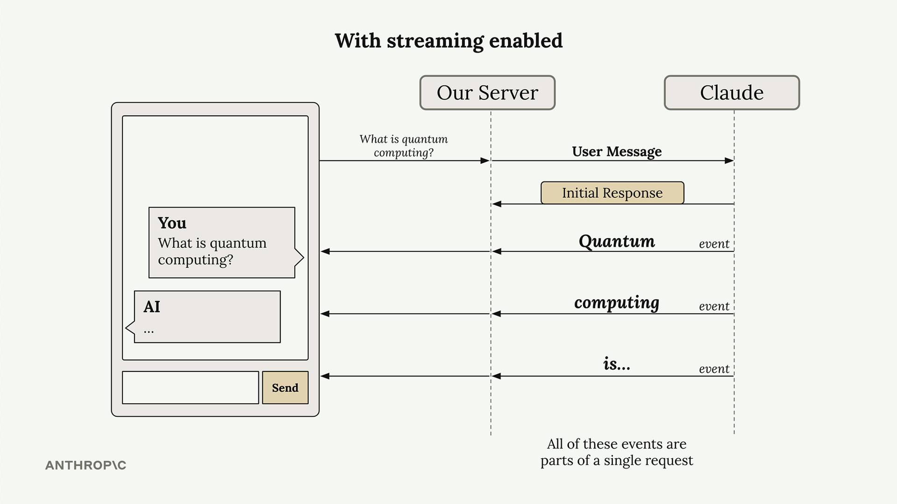
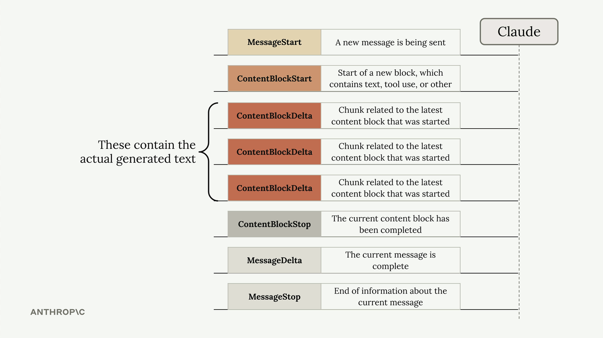

# Streaming responses

## How Streaming Works

With streaming enabled, Claude immediately sends back an initial response indicating it has received your request and is starting to generate text. Then you receive a series of events, each containing a small piece of the overall response.

Your server can forward these text chunks to your client application as they arrive, allowing users to see the response building up word by word. All of these events are part of a single request to Claude.

## Understanding Stream Events

When you enable streaming, Claude sends back several types of events:

- MessageStart - A new message is being sent
- ContentBlockStart - Start of a new block containing text, tool use, or other content
- ContentBlockDelta - Chunks of the actual generated text
- ContentBlockStop - The current content block has been completed
- MessageDelta - The current message is complete
- MessageStop - End of information about the current message

The `ContentBlockDelta` events contain the actual generated text that you'll want to display to users.
