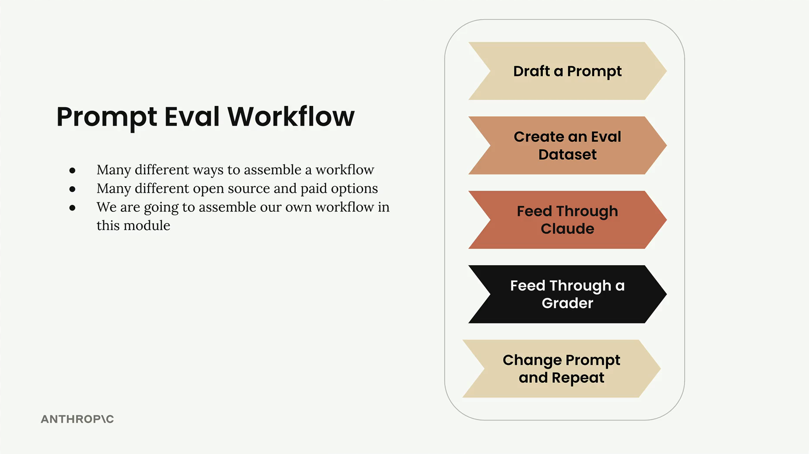

## Eval workflow

A typical prompt evaluation workflow follows five key steps that help you systematically improve your prompts through objective measurement. While there are many different ways to assemble these workflows and various open source and paid tools available, understanding the core process helps you start small and scale up as needed.

