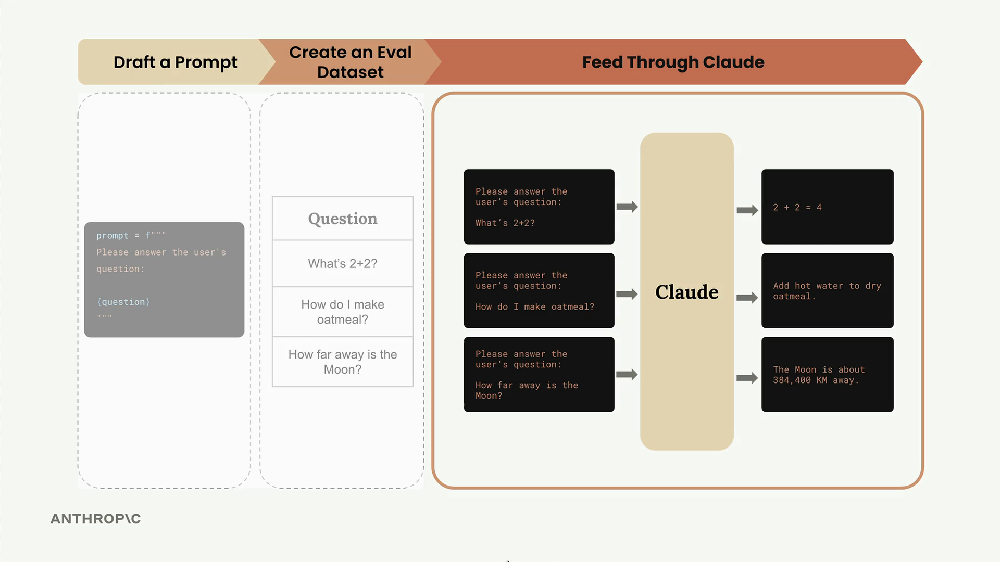

## Running Eval

Now that we have our evaluation dataset ready, it's time to build the core evaluation pipeline. This involves taking each test case, merging it with our prompt, feeding it to Claude, and then grading the results.

