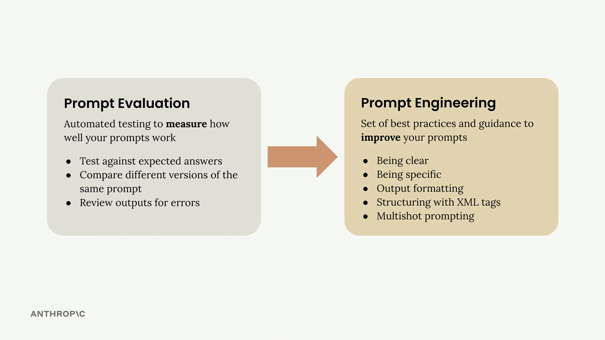
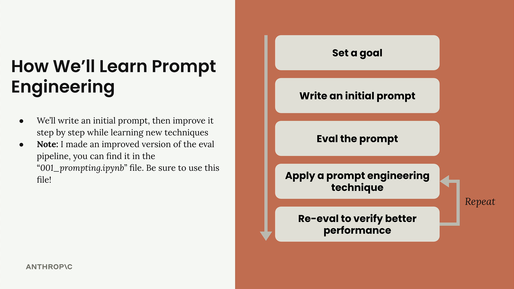

# Prompt Engineering

Prompt engineering is about taking a prompt you've written and improving it to get more reliable, higher-quality outputs. This process involves iterative refinement - starting with a basic prompt, evaluating its performance, then systematically applying engineering techniques to improve it.

## The Iterative Improvement Process

Set a goal - Define what you want your prompt to accomplish
Write an initial prompt - Create a basic first attempt
Evaluate the prompt - Test it against your criteria
Apply prompt engineering techniques - Use specific methods to improve performance
Re-evaluate - Verify that your changes actually improved the results
