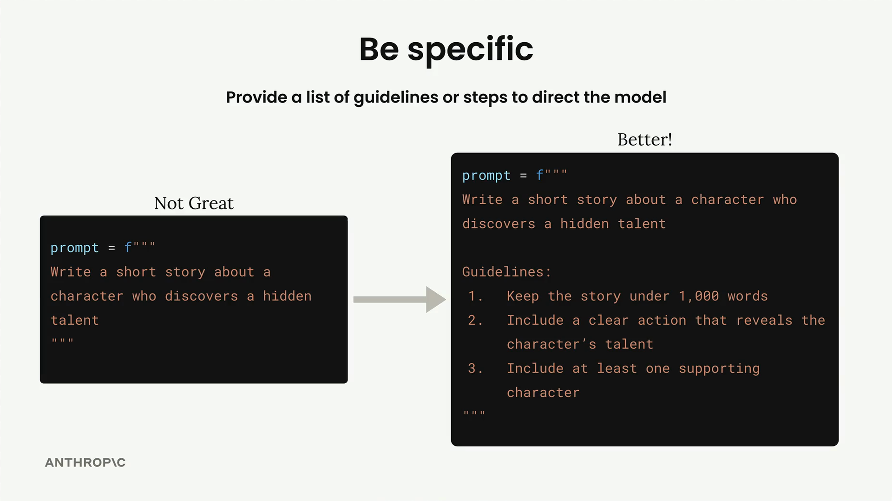
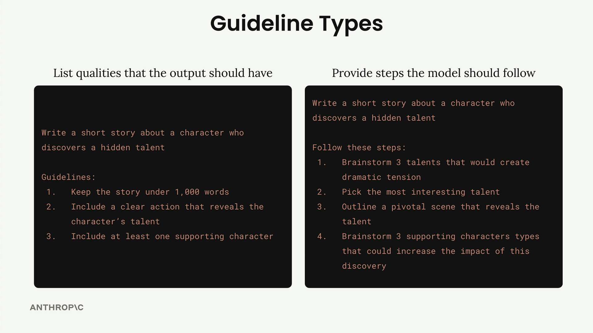

## Being Specific

When working with Claude, one of the most effective ways to improve your results is to be specific about what you want. Instead of leaving everything up to the model's interpretation, you can provide clear guidelines or steps that direct Claude toward the kind of output you're looking for.

### Two Types of Guidelines

