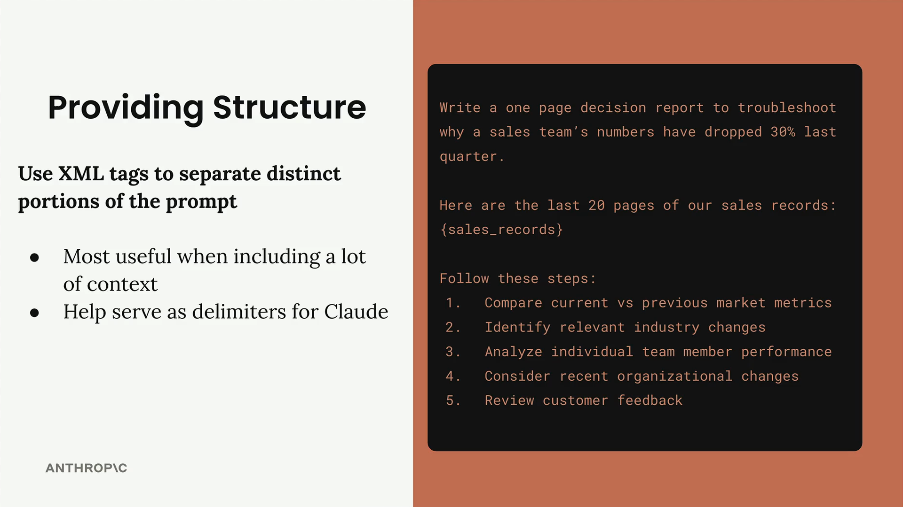
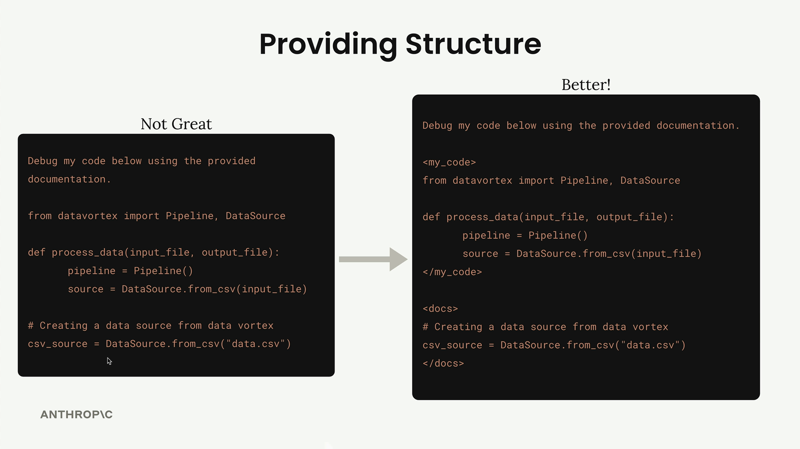

## Structure with XML Tags

When you're building prompts that include a lot of content, Claude can sometimes struggle to understand which pieces of text belong together or what different sections are supposed to represent. XML tags provide a simple way to add structure and clarity to your prompts, especially when you're interpolating large amounts of data.

### Why Structure Matters

The example above shows how unclear boundaries can make it difficult for Claude to parse your intent. By wrapping the sales records in XML tags like <sales_records> and </sales_records>, you create clear delimiters that help Claude understand the structure of your prompt.

The example above shows how unclear boundaries can make it difficult for Claude to parse your intent. By wrapping the sales records in XML tags like <sales_records> and </sales_records>, you create clear delimiters that help Claude understand the structure of your prompt.

### Practical Example: Code and Documentation

