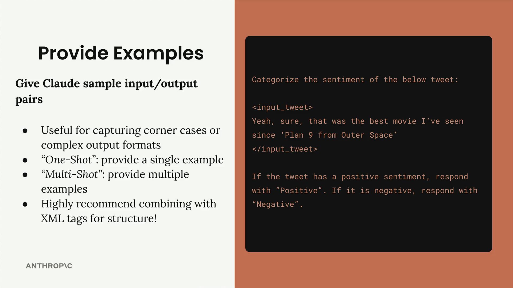
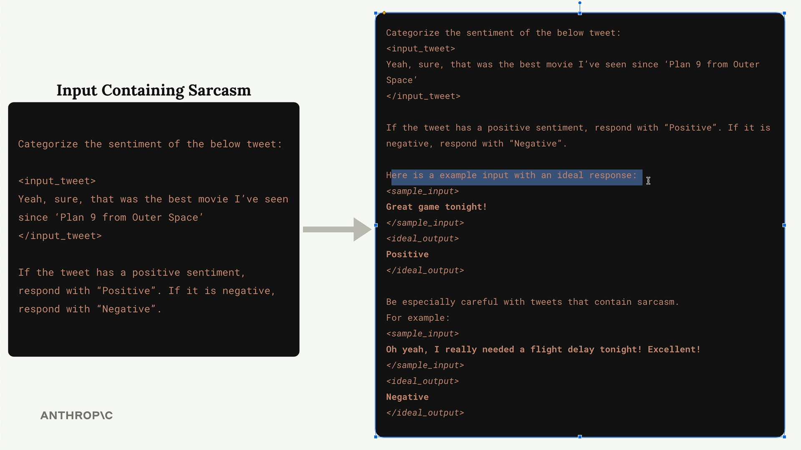

## Providing Examples

Providing examples in your prompts is one of the most effective prompt engineering techniques you'll use. This approach, known as "one-shot" or "multi-shot" prompting, involves giving Claude sample input/output pairs to guide its responses.

### How Examples Work

Let's look at a sentiment analysis example. Say you want Claude to categorize whether a tweet is positive or negative:

### Adding Examples to Handle Corner Cases

To solve this, you can add examples that show Claude how to handle tricky cases:

