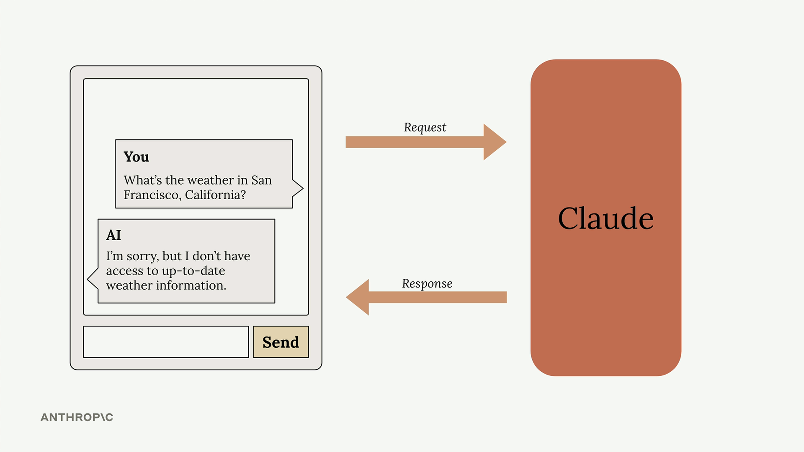
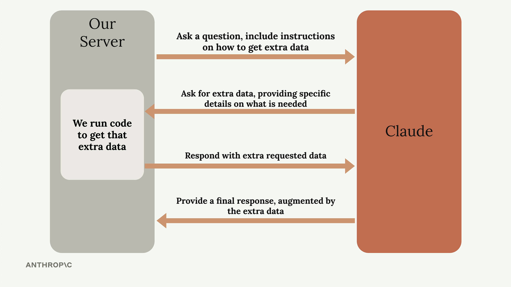

## Intro to tools use

Tools allow Claude to access information from the outside world, extending its capabilities beyond what it learned during training. By default, Claude only knows information from its training data and can't access current events, real-time data, or external systems. Tool use solves this limitation by creating a structured way for Claude to request and receive fresh information.

## The Problem Without Tools

When users ask Claude for current information, it hits a wall. For example, if someone asks "What's the weather in San Francisco, California?" Claude has to respond with something like "I'm sorry, but I don't have access to up-to-date weather information."

## How Tool Use Works

Tool use follows a specific back-and-forth pattern between your application and Claude. Here's the complete flow:

