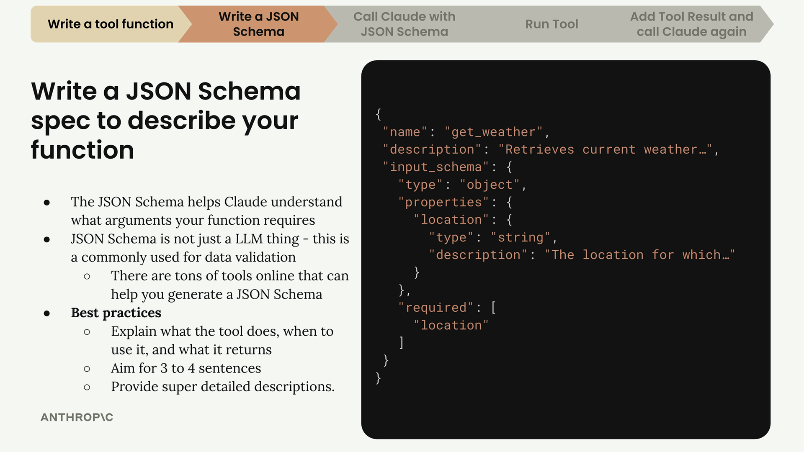
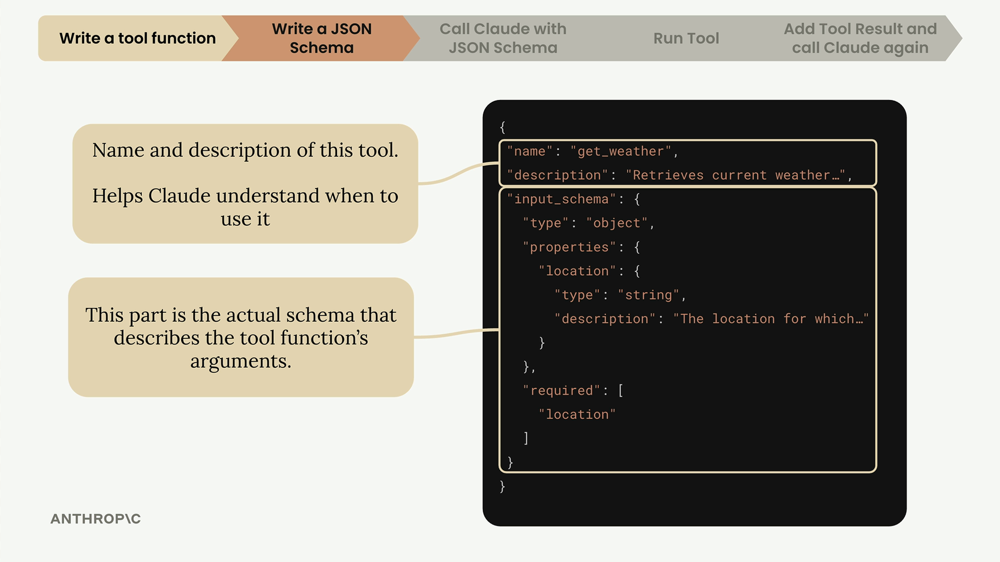

## Tool schemas

### Understanding JSON Schema

JSON Schema isn't specific to AI or tool calling - it's a widely-used data validation specification that's been around for years. The AI community adopted it because it's a convenient way to describe function parameters and validate data.

### Writing Effective Descriptions

### The Easy Way to Generate Schemas

1. Copy your tool function code
2. Go to Claude and ask it to write a JSON schema for tool calling
3. Include the Anthropic documentation on tool use as context
4. Let Claude generate a properly formatted schema following best practices
