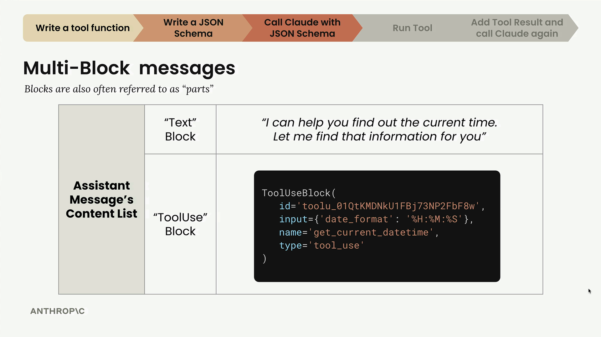
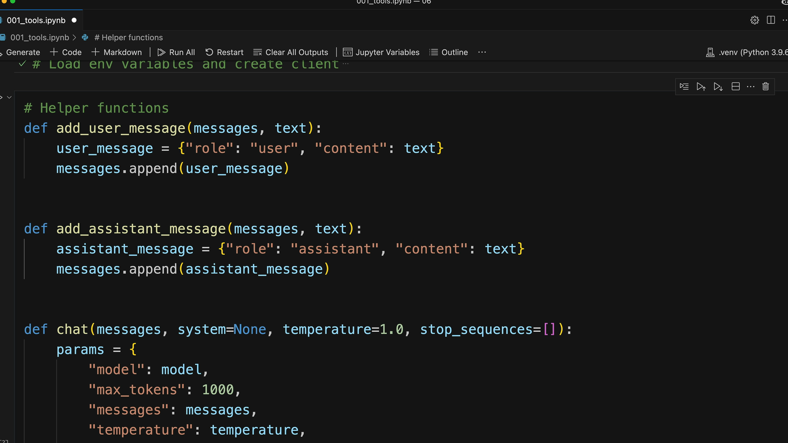
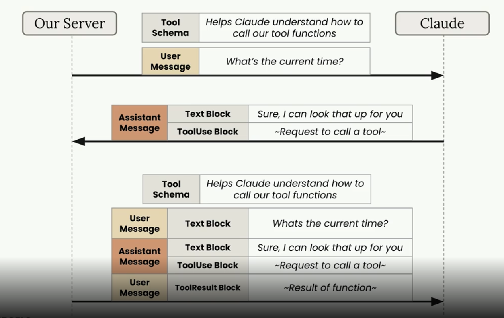
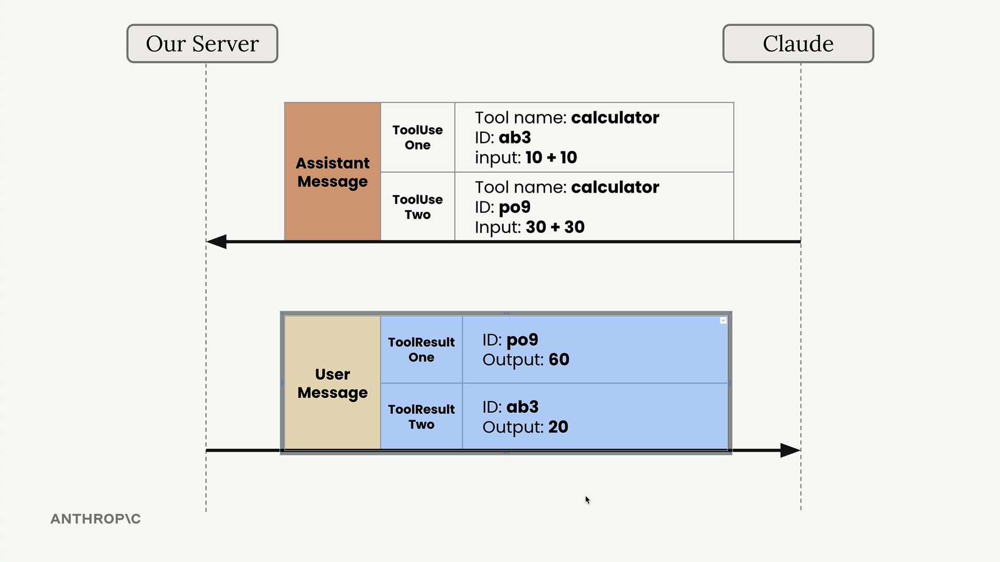
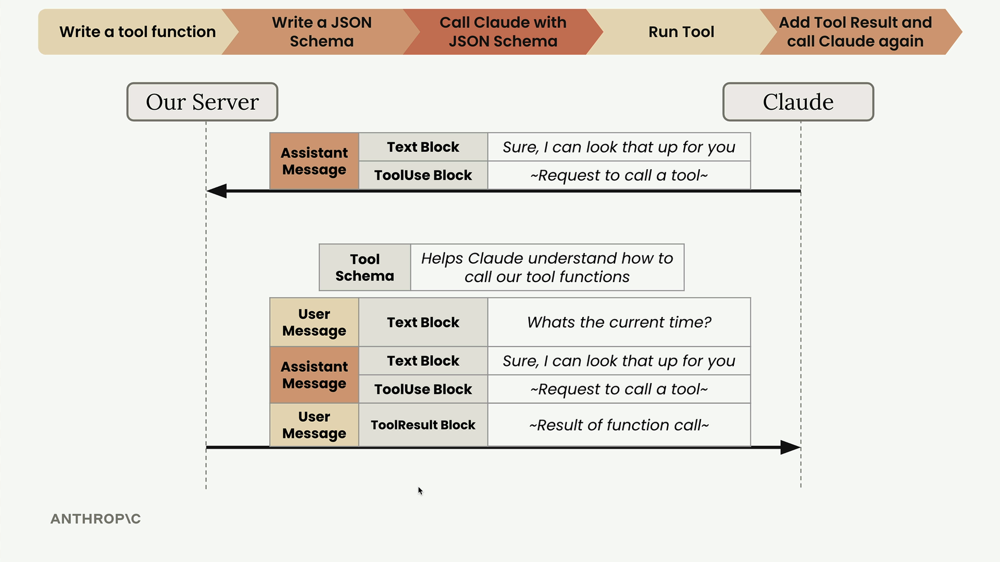

### Understanding Multi-Block Messages

### The Complete Tool Usage Flow

### How tool use works

When we get the toolsUse block from the claude, we need to send the whole conversation back

### Handling Multiple Tool Calls

Each tool call gets a unique ID

### Making the Final Request

