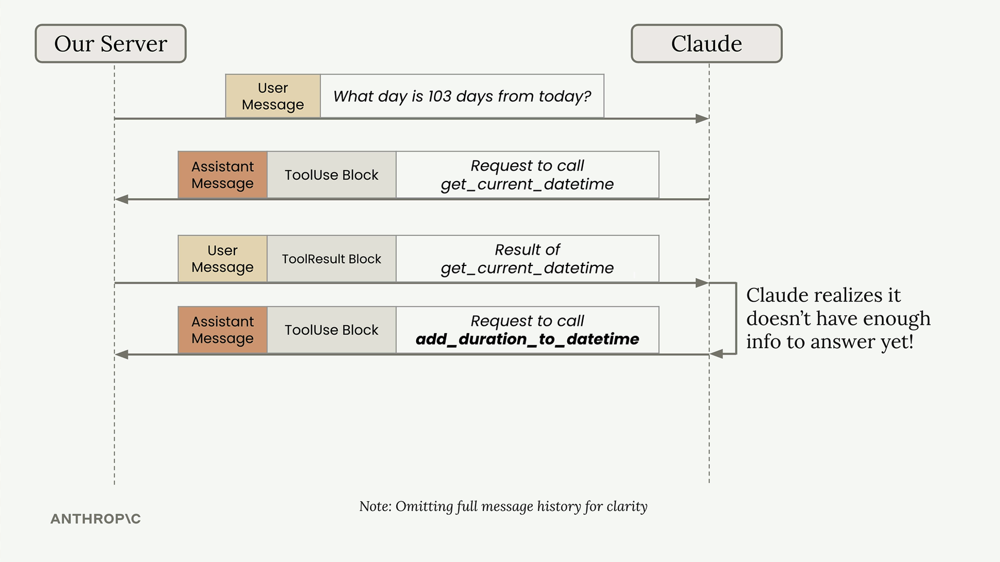
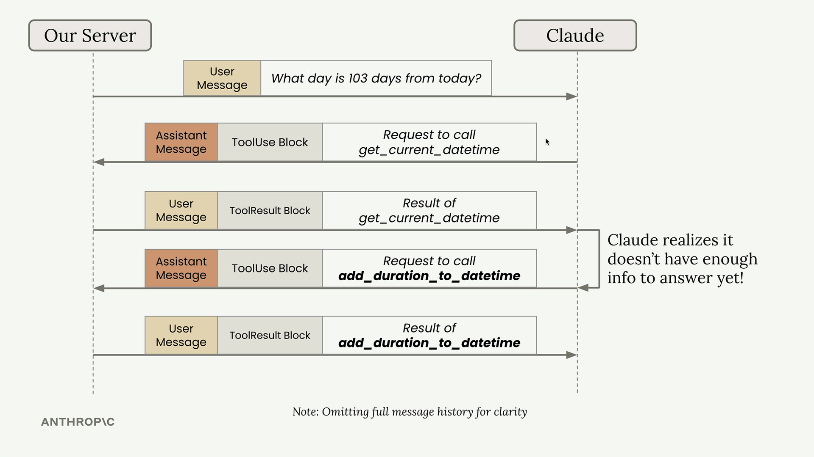
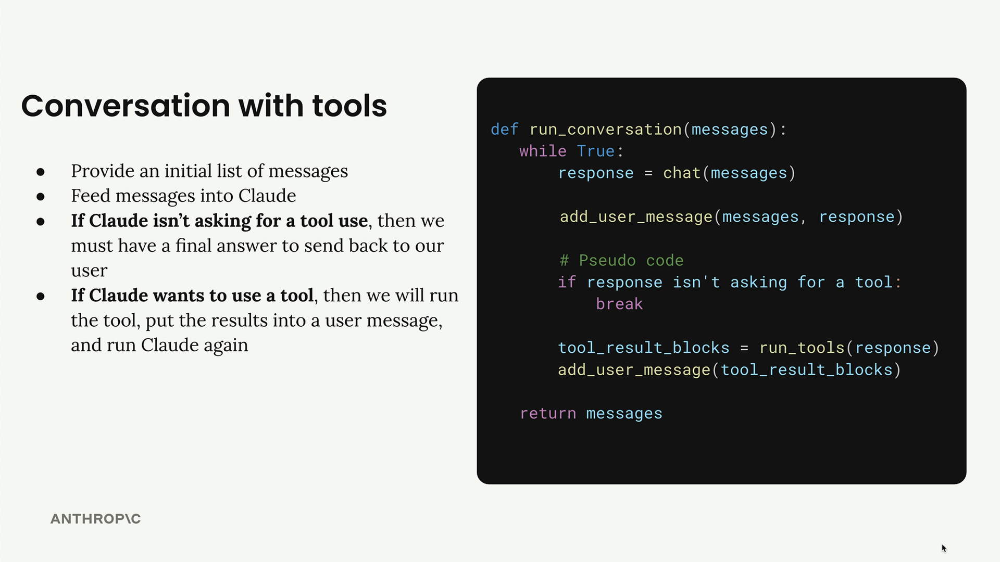

## Multi Tool conversations

When building applications with multiple tools, you need to handle scenarios where Claude might need to call several tools in sequence to answer a single user question. For example, if a user asks "What day is 103 days from today?", Claude needs to first get the current date, then add 103 days to it.

## The Multi-Turn Tool Pattern

## Building a Conversation Loop

