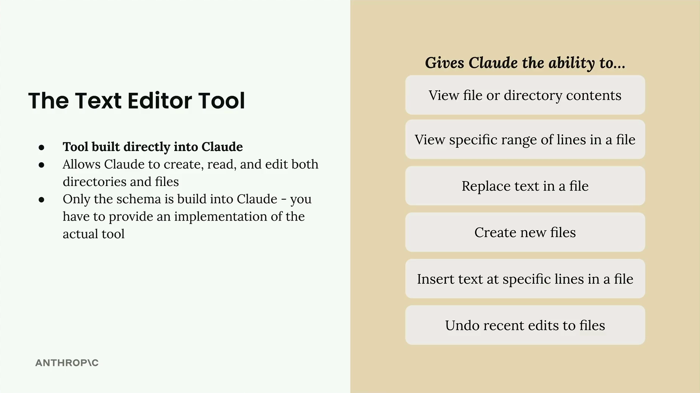

## Text Editor tool

### What the Text Editor Tool Can Do

The text editor tool provides Claude with a comprehensive set of file manipulation capabilities:

- View file or directory contents
- View specific ranges of lines in a file
- Replace text in a file
- Create new files
- Insert text at specific lines in a file
- Undo recent edits to files

  
