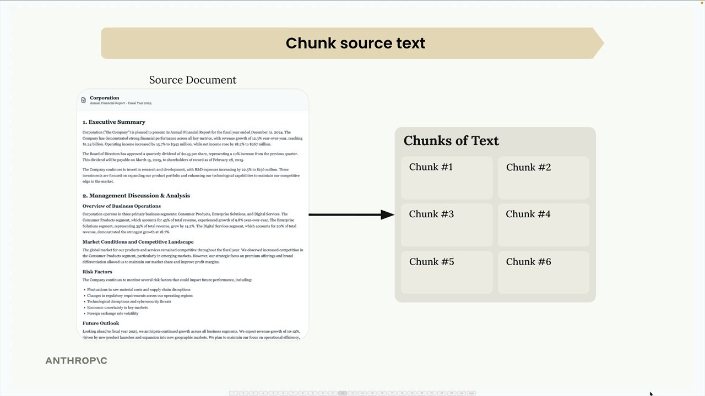
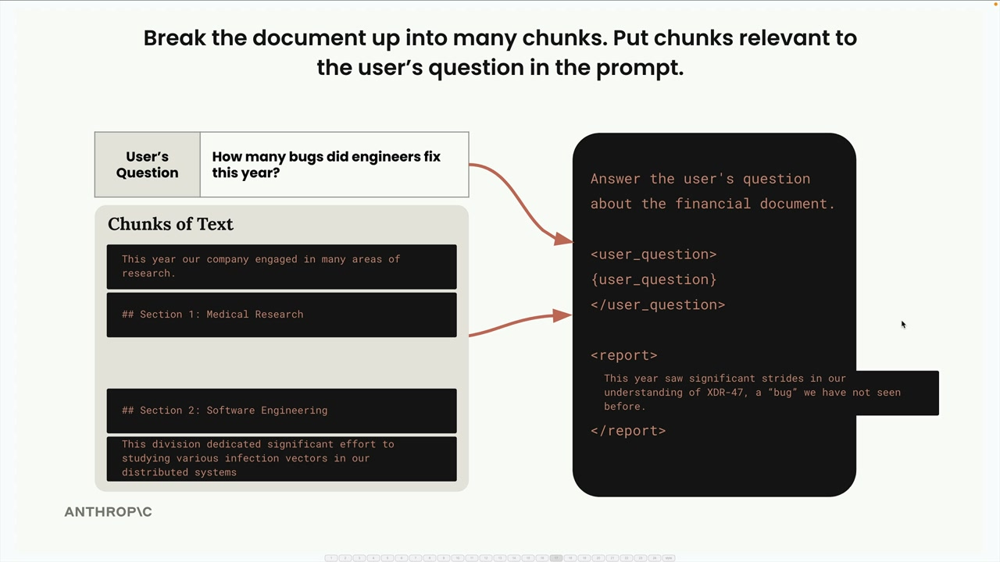
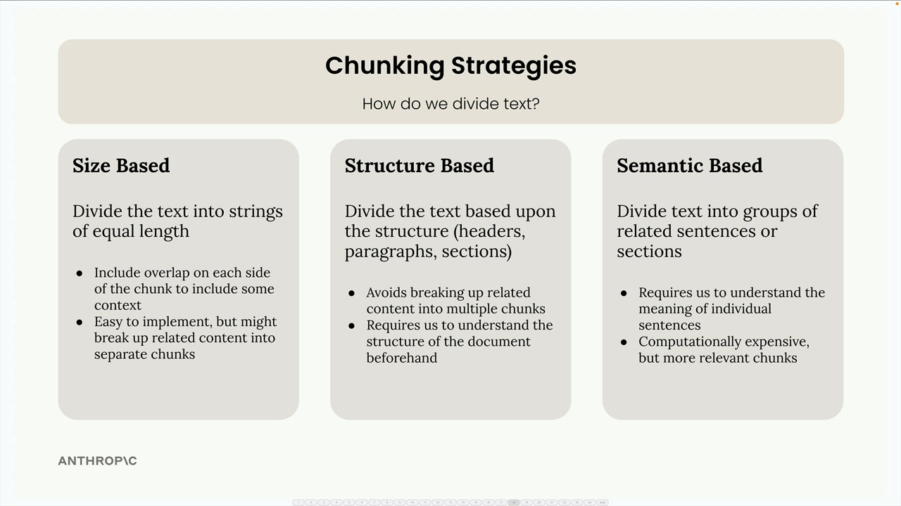

## Chunking

### What is Chunking

Text chunking is one of the most critical steps in building a RAG (Retrieval Augmented Generation) pipeline. How you break up your documents directly impacts the quality of your entire system. A poor chunking strategy can lead to irrelevant context being inserted into your prompts, causing your AI to give completely wrong answers.

### Chunking Strategies

### Size-Based Chunking
Size-based chunking is the simplest approach - you divide your text into strings of equal length. If you have a 325-character document, you might split it into three chunks of roughly 108 characters each.

