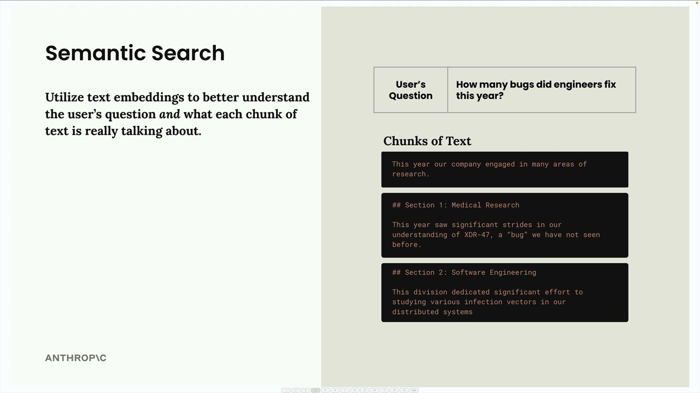
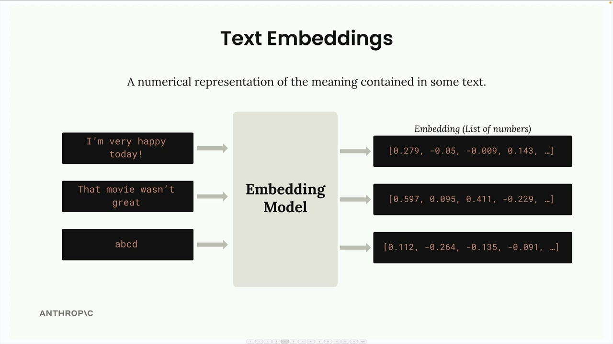
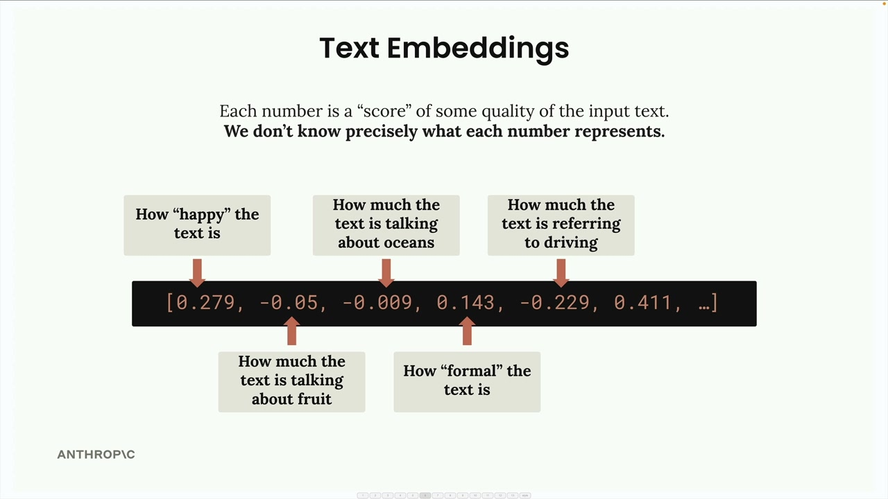

## Embeddings

### Semantic Search

The most common approach for finding relevant chunks is semantic search. Unlike keyword-based search that looks for exact word matches, semantic search uses text embeddings to understand the meaning and context of both the user's question and each text chunk.

### Text Embeddings

A text embedding is a numerical representation of the meaning contained in some text. Think of it as converting words and sentences into a format that computers can work with mathematically.

### Understanding the Numbers

Each number in an embedding is essentially a "score" for some quality of the input text. However, here's the important caveat: we don't know precisely what each number represents.

