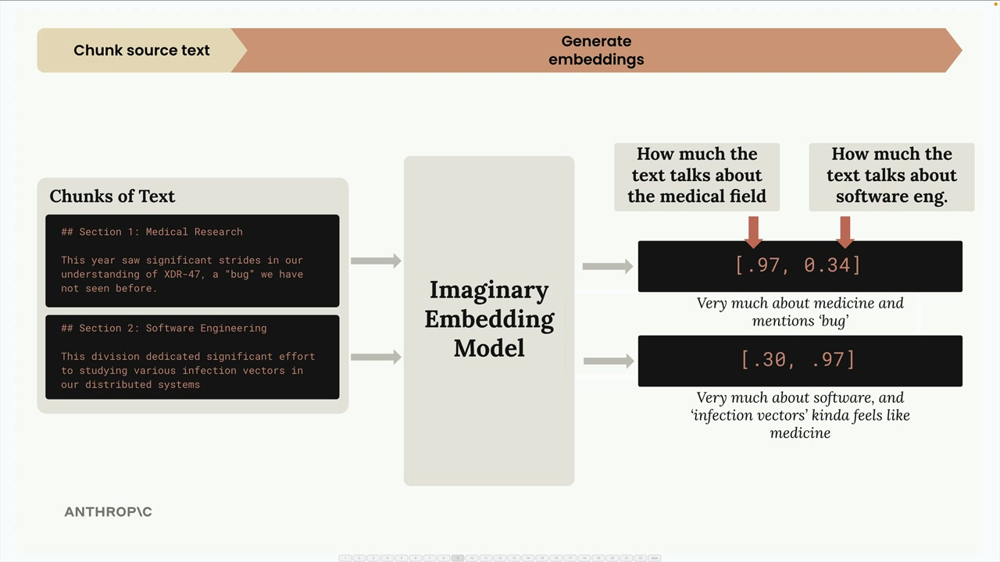
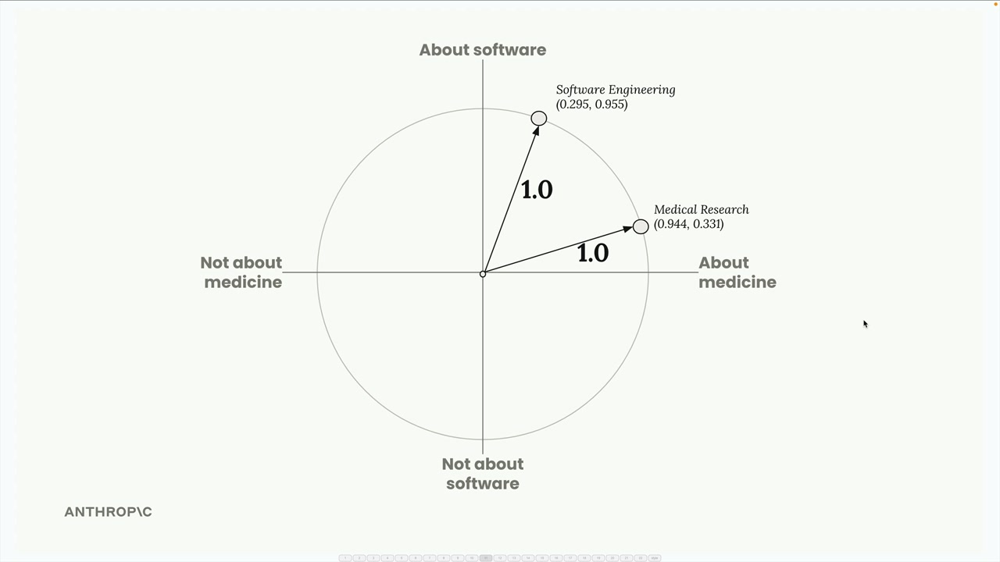
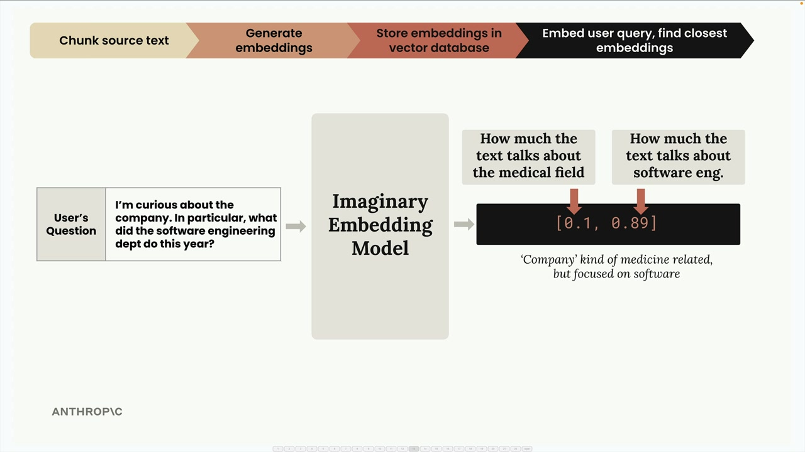
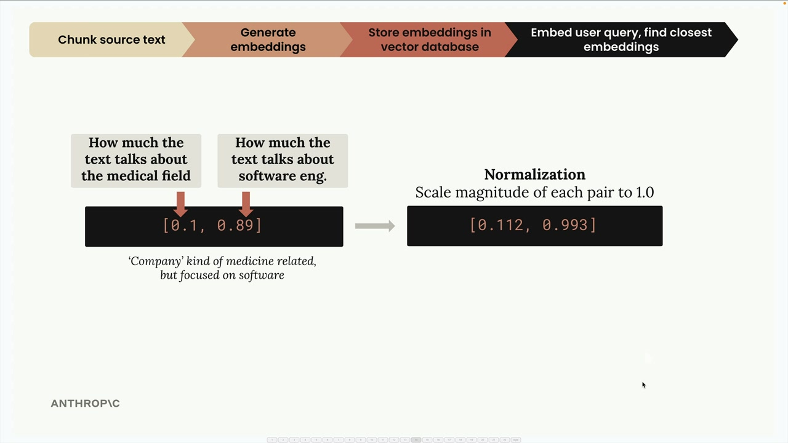
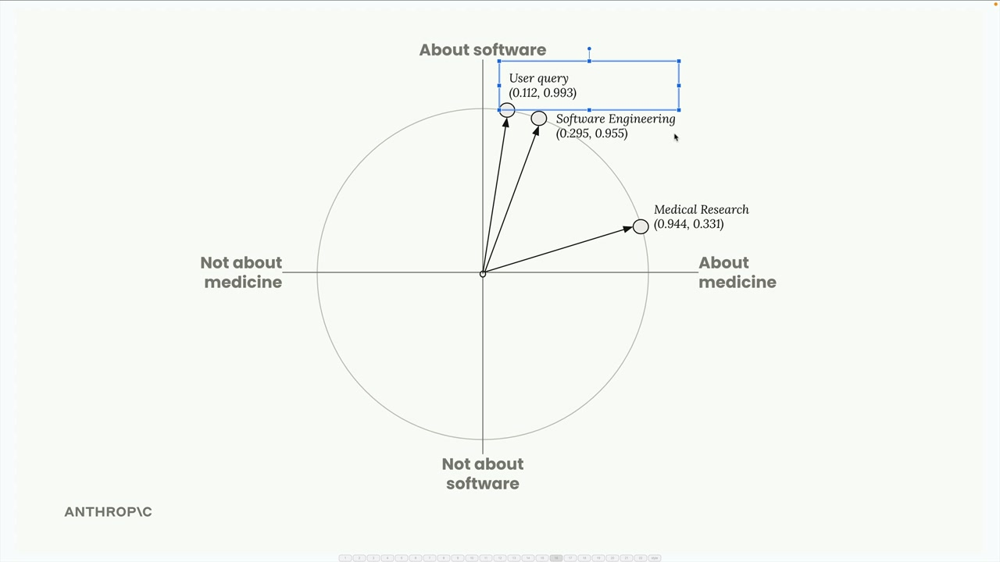
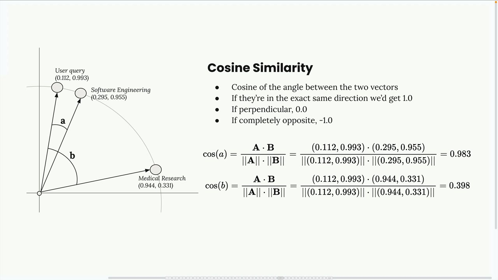
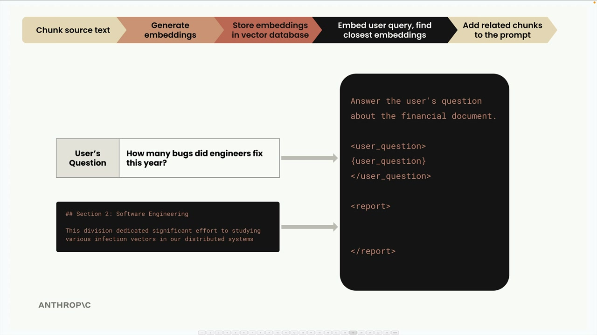

## Full RAG Flow


### Step 1: Chunk Your Source Text
First, we take our source document and break it into manageable chunks. For this example, we'll use two simple text sections:

Section 1: Medical Research - "This year saw significant strides in our understanding of XDR-47, a 'bug' we have not seen before."
Section 2: Software Engineering - "This division dedicated significant effort to studying various infection vectors in our distributed systems"

### Step 2: Generate Embeddings

Next, we convert each text chunk into numerical embeddings using an embedding model. To make this easier to understand, let's imagine we have a perfect embedding model that always returns exactly two numbers, and we know what each number represents.



### Normalization

The embedding API typically performs a normalization step that scales each vector to have a magnitude of 1.0. 



### Step 3: Store in Vector Database

We store these embeddings in a vector database - a specialized database optimized for storing, comparing, and searching through long lists of numbers like our embeddings.



### Step 4: Process User Query

When a user asks a question like "I'm curious about the company. In particular, what did the software engineering dept do this year?", we run their query through the same embedding model.



### Step 5: Find Similar Embeddings



### How Similarity Works: Cosine Similarity
The vector database uses cosine similarity to determine which embeddings are most similar. This measures the cosine of the angle between two vectors.




### Step 6: Create the Final Prompt




### Prompt might look like this:

```
Answer the user's question about the financial document.

<user_question>
How many bugs did engineers fix this year?
</user_question>

<report>
## Section 2: Software Engineering
This division dedicated significant effort to studying various infection vectors in our distributed systems
</report>
```