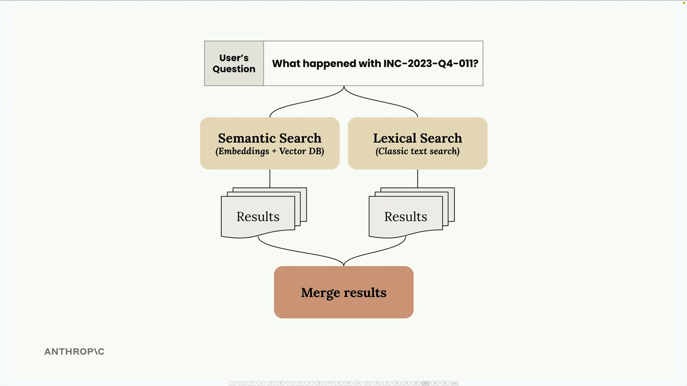
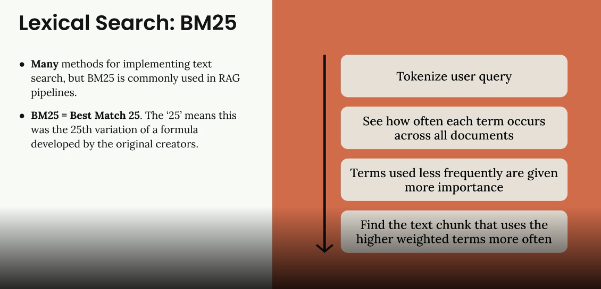
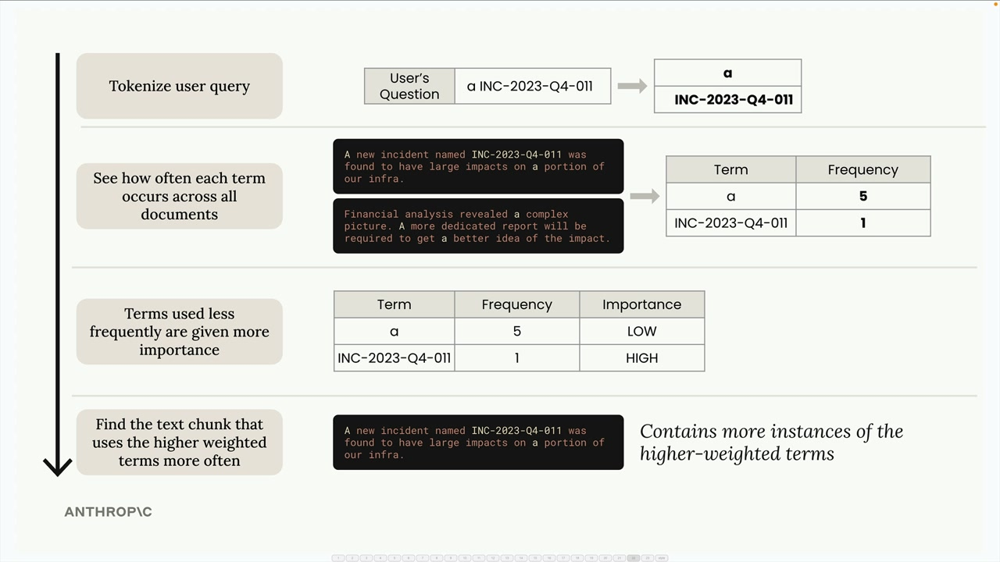

## BM25 lexical search

### The Problem with Semantic Search Alone

Let's say you're searching for a specific incident ID like "INC-2023-Q4-011" in a document. While semantic search excels at understanding context and meaning, it might return sections that are semantically related but don't actually contain the exact term you're looking for.

In the example above, semantic search returned the cybersecurity section (which does contain the incident ID) but also returned a financial analysis section that doesn't mention the incident at all. This happens because semantic search focuses on conceptual similarity rather than exact term matching.

### Hybrid Search Strategy

The solution is to run both semantic and lexical searches in parallel, then merge the results. This gives you the best of both worlds:

- Semantic search finds conceptually related content using embeddings
- Lexical search finds exact term matches using classic text search
- Merged results combine both approaches for better accuracy

### Lexical Search: BM 25

### How BM25 Works

BM25 (Best Match 25) is a popular algorithm for lexical search in RAG systems. Here's how it processes a search query:

