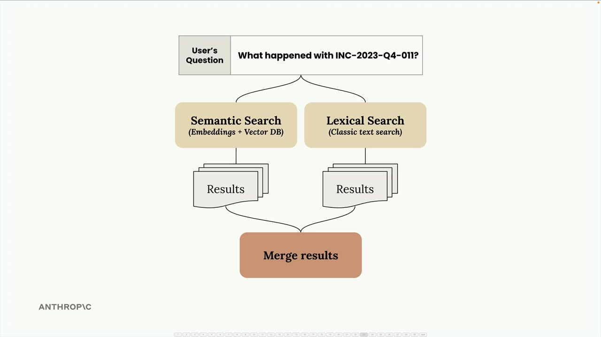
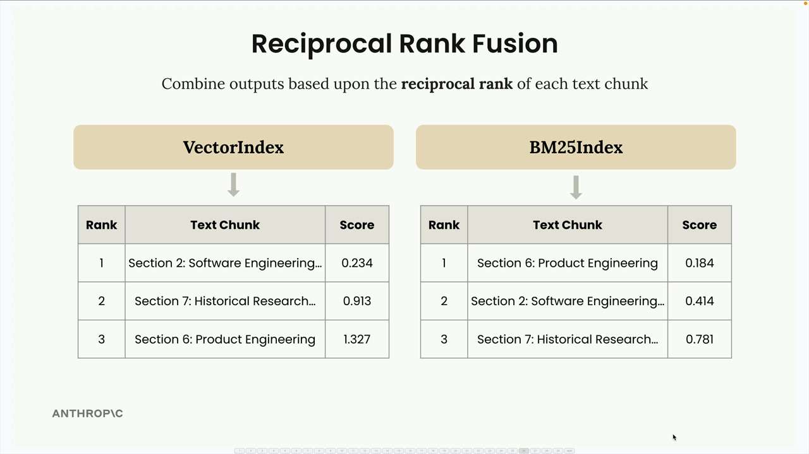
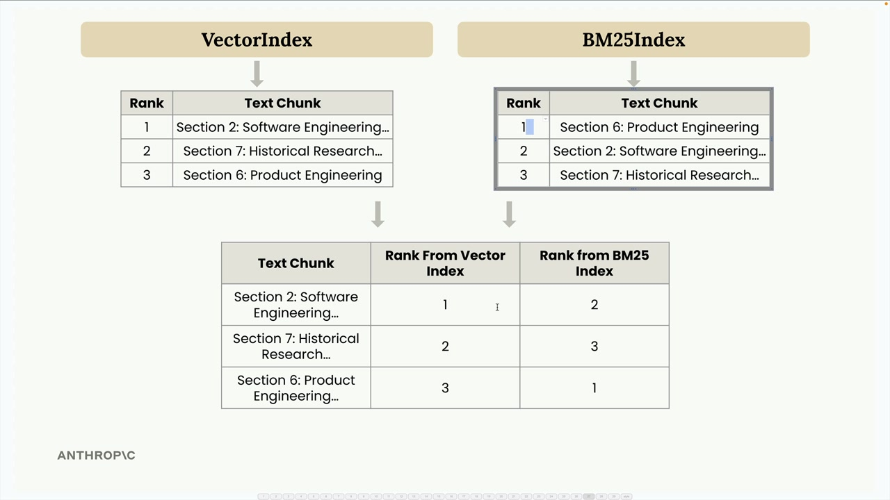
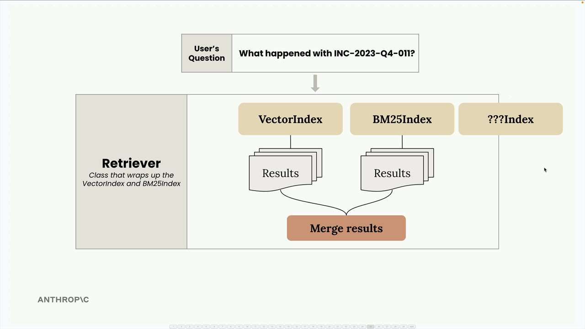

## A Multi-Index RAG pipeline

### The Multi-Index Architecture

Both our VectorIndex and BM25Index classes share nearly identical APIs - they both have add_document() and search() methods. This consistency makes it straightforward to wrap them together in a new class called Retriever.



### Understanding Reciprocal Rank Fusion

Merging results from different search methods isn't as simple as just concatenating lists. Each method uses different scoring systems, so we need a way to normalize and combine their rankings fairly.




Here's how reciprocal rank fusion works with an example. Let's say we search for information about "INC-2023-Q4-011" and get these results:

- VectorIndex returns: Section 2 (rank 1), Section 7 (rank 2), Section 6 (rank 3)
- BM25Index returns: Section 6 (rank 1), Section 2 (rank 2), Section 7 (rank 3)




We combine these into a single table showing each text chunk's rank from both indexes, then apply the RRF formula:


```
RRF_score(d) = Σ(1 / (k + rank_i(d)))

```

### Extensibility



The beauty of this architecture is its extensibility. Since all indexes implement the same SearchIndex protocol with add_document() and search() methods, you can easily add new search methodologies:

