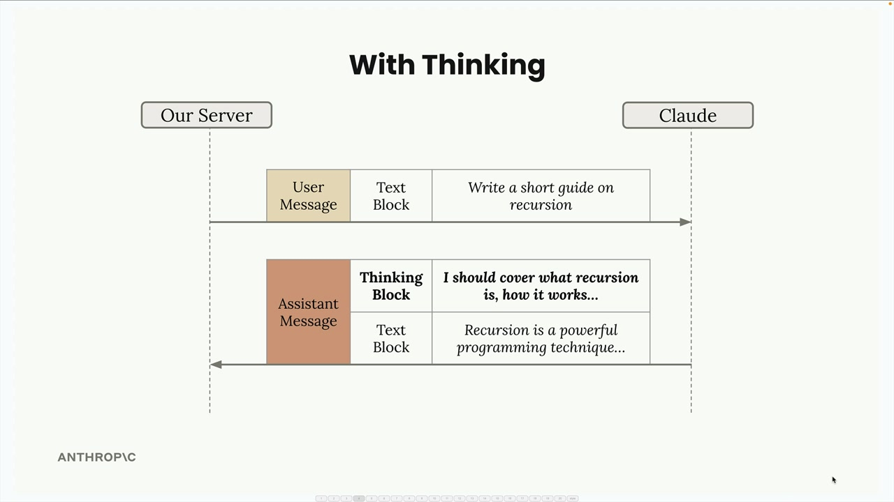
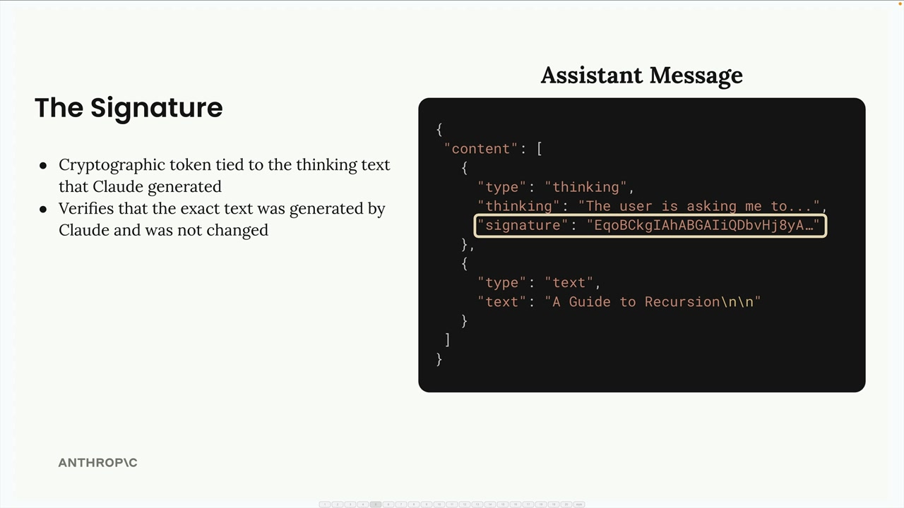

## Extended Thinking

### How Extended Thinking Works

When extended thinking is enabled, Claude's response changes from a simple text block to a structured response containing two parts:

### When to Use Extended Thinking

The decision is straightforward: use your prompt evaluations. Run your prompts without thinking first, and if the accuracy isn't meeting your requirements after you've already optimized your prompt, then consider enabling extended thinking. It's a tool for when standard prompting isn't quite getting you there.

### Response Structure and Security

Extended thinking responses include a special signature system for security:

