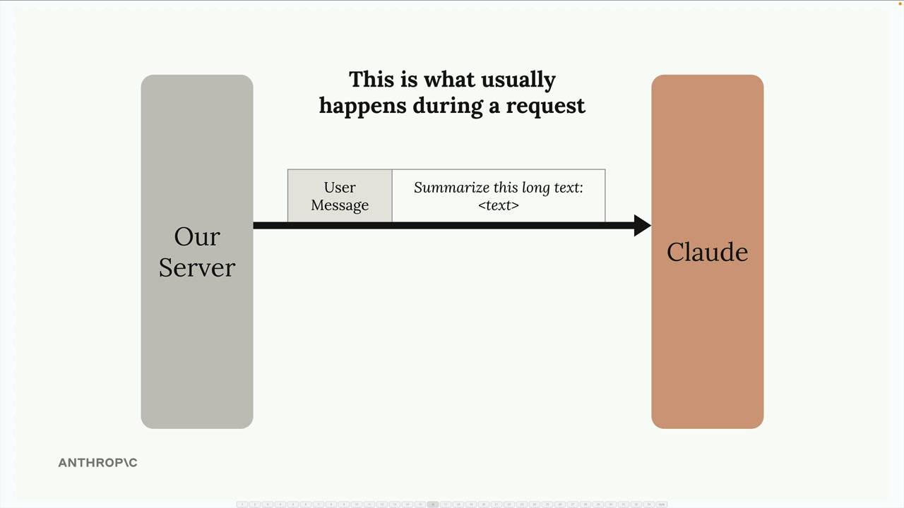
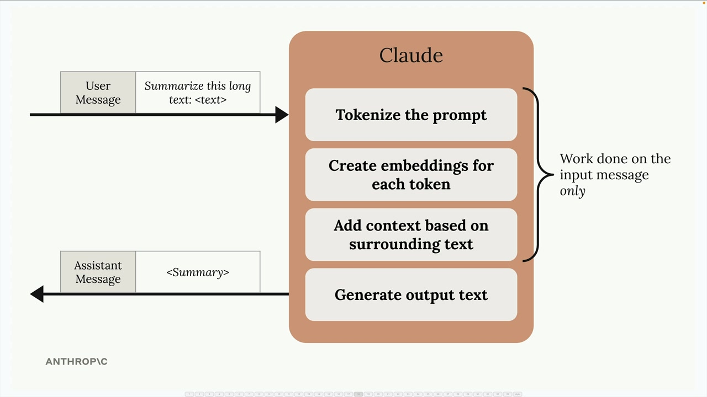
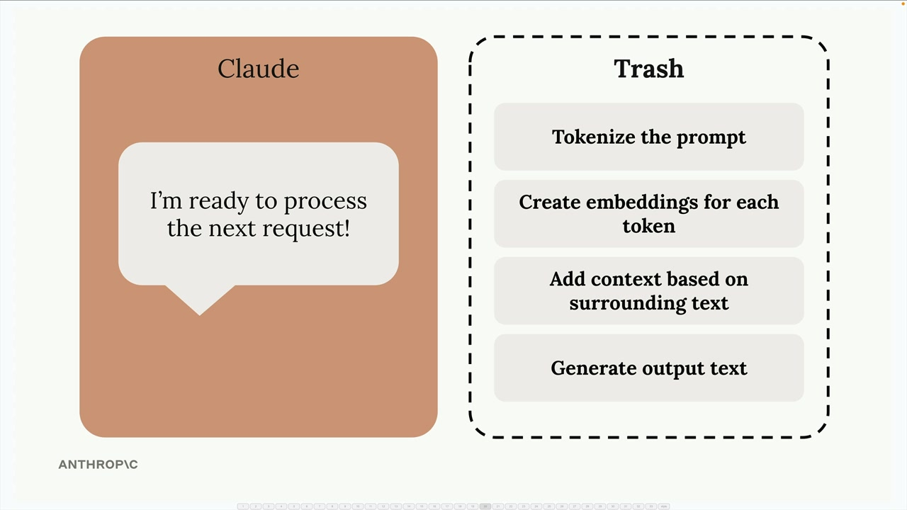
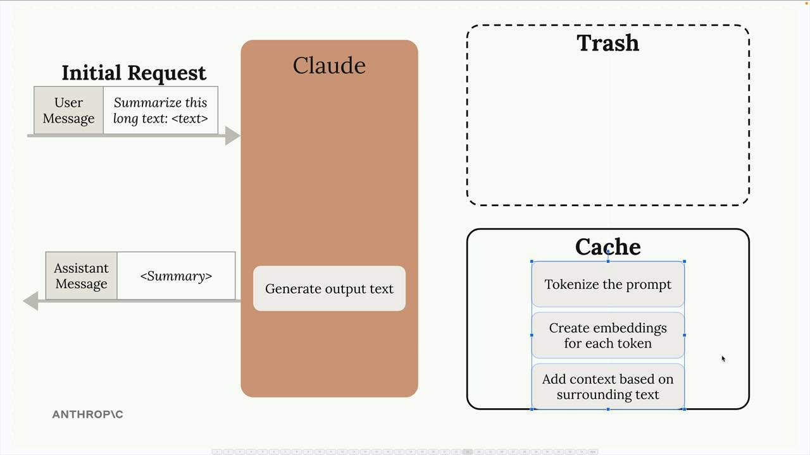
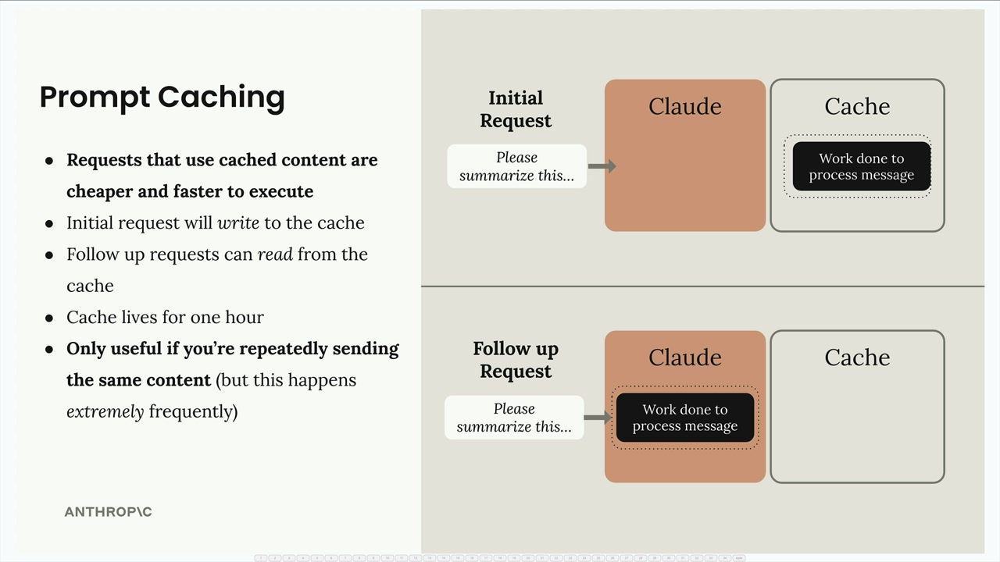

## Prompt caching

### How Claude Normally Processes Requests

When you send a message to Claude, it doesn't immediately start generating a response. Instead, Claude does a tremendous amount of preprocessing work on your input:

- Tokenizes the prompt into smaller pieces
- Creates embeddings for each token
- Adds context based on surrounding text
- Only then generates the actual output text

After sending you the response, Claude throws away all this computational work - the tokenization, embeddings, and context analysis all get discarded.

This becomes inefficient when you make follow-up requests that include the same content. For example, in a conversation where you're asking Claude to refine a summary of the same long text:

### How Prompt Caching Solves This

### Key Benefits and Limitations

Prompt caching offers several advantages:

- Faster responses: Requests using cached content execute more quickly
- Lower costs: You pay less for the cached portions of your requests
- Automatic optimization: The initial request writes to the cache, follow-up requests read from it
However, there are important limitations to keep in mind:

- Cache duration: Cached content only lives for one hour
- Limited use cases: Only beneficial when you're repeatedly sending the same content
- High frequency requirement: Most effective when the same content appears extremely frequently in your requests