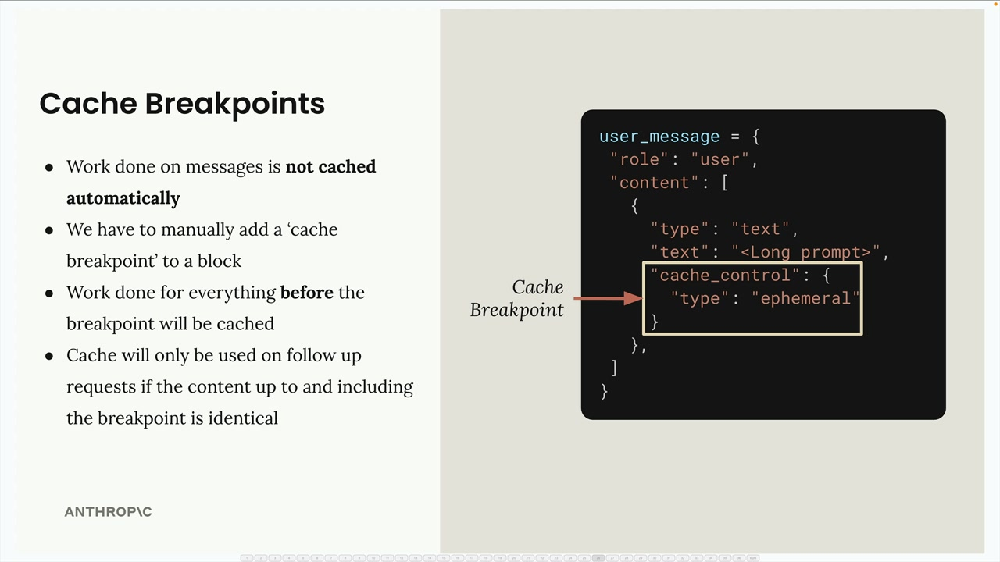
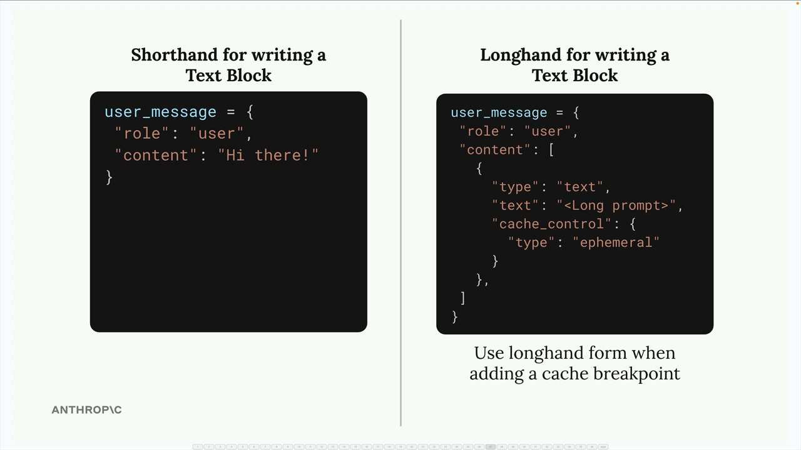
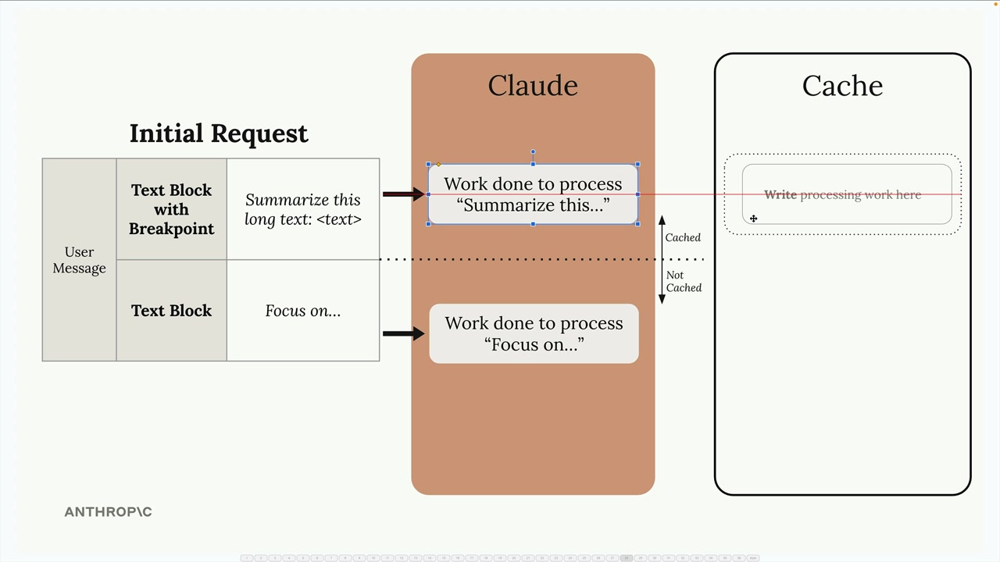
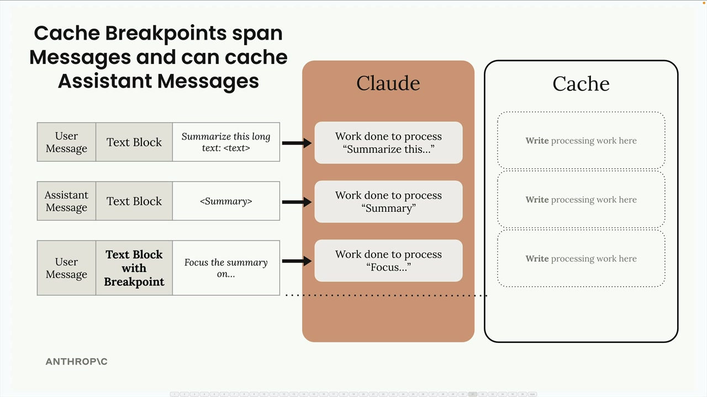
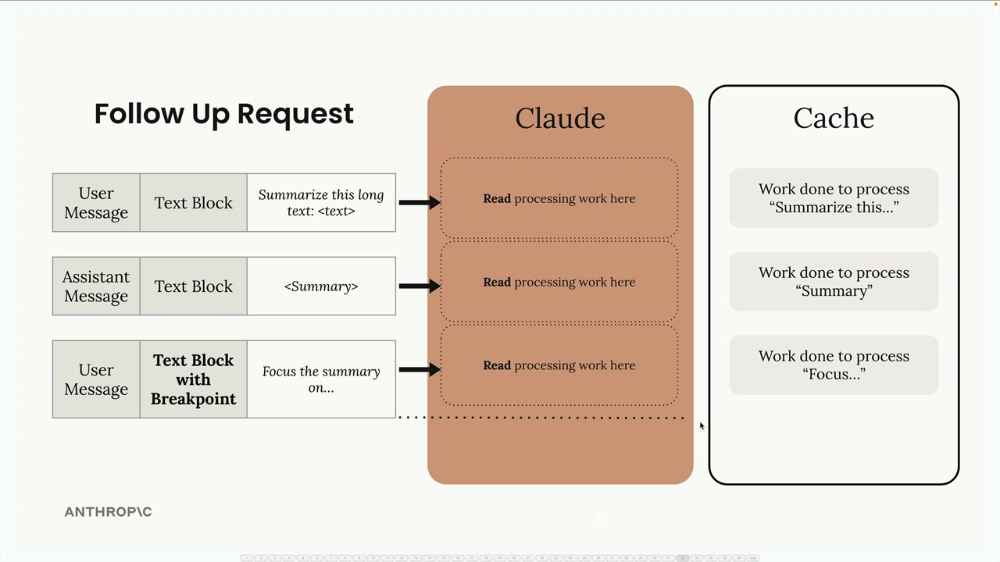
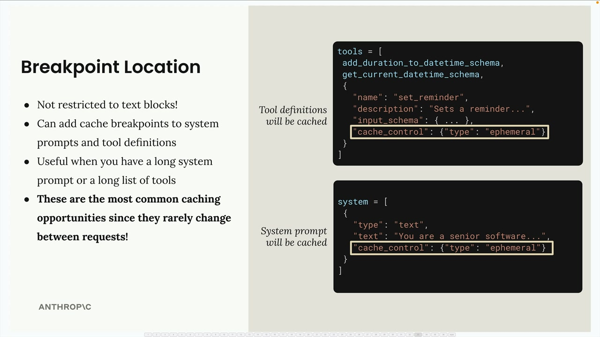
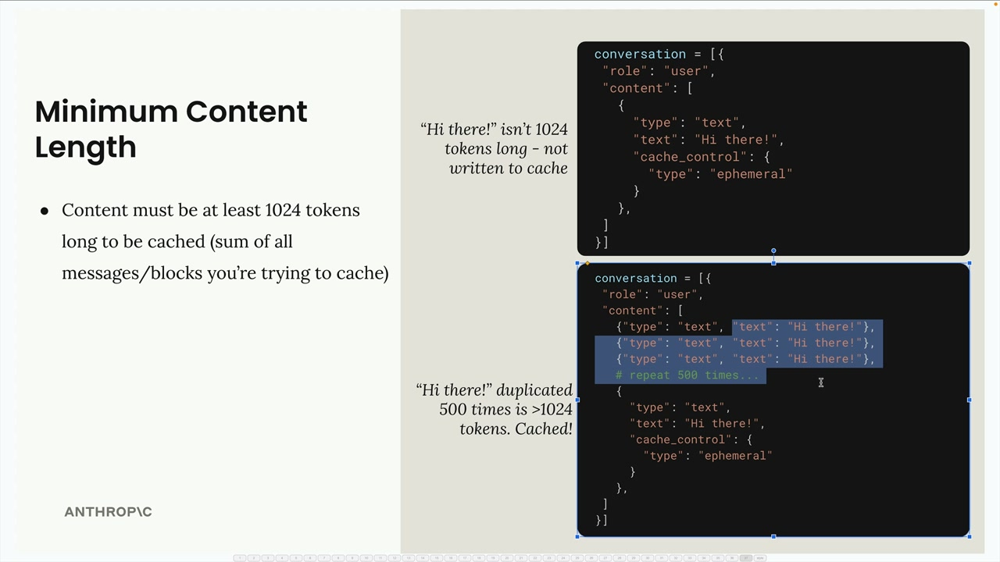

## Rules of prompt caching

## Cache Breakpoints

Caching isn't enabled automatically - you need to manually add cache breakpoints to specific blocks in your messages. Here's how it works:

- Work done on messages is not cached automatically
- You must manually add a 'cache breakpoint' to a block
- Work done for everything before the breakpoint will be cached
- Cache will only be used on follow-up requests if the content up to and including the breakpoint is identical

To add a cache breakpoint, you need to use the longhand form for writing text blocks instead of the shorthand:

The shorthand form doesn't provide a place to add the cache control field, so you must use the expanded format with the cache_control field set to {"type": "ephemeral"}.

### How Cache Breakpoints Work

When you place a cache breakpoint in a message, Claude caches all the processing work up to and including that breakpoint. Content after the breakpoint is processed normally without caching.

For the cache to be useful in follow-up requests, the content must be identical up to the breakpoint.

### Cross-Message Caching

Cache breakpoints can span across multiple messages and message types. If you place a breakpoint in a later message, all previous messages (user, assistant, etc.) will be included in the cached content.

### System Prompts and Tools

You're not limited to text blocks - cache breakpoints can be added to:

- System prompts
- Tool definitions
- Image blocks
- Tool use and tool result blocks

### Minimum Content Length
There's a minimum threshold for caching: content must be at least 1024 tokens long to be cached. This is the sum of all messages and blocks you're trying to cache, not individual blocks.

