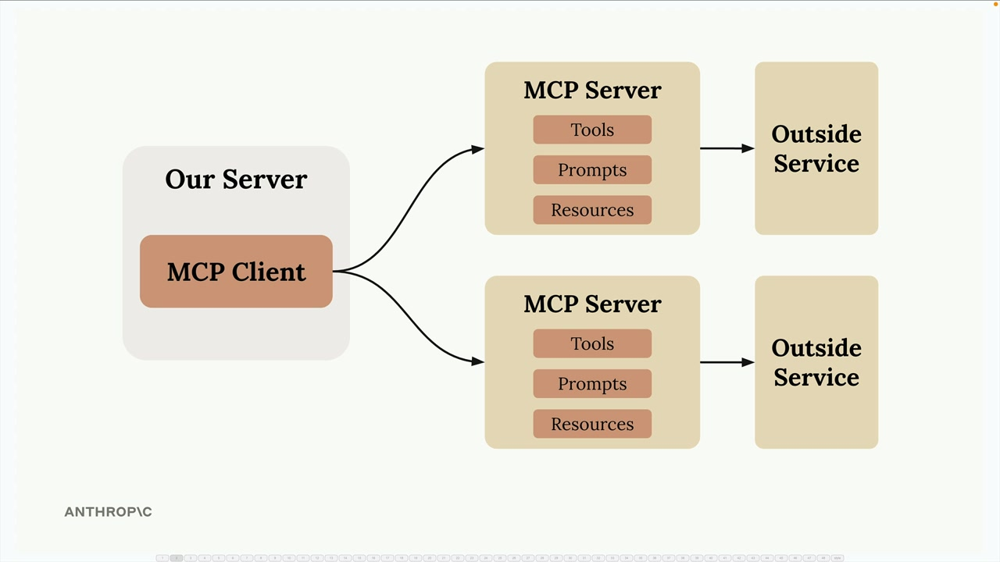
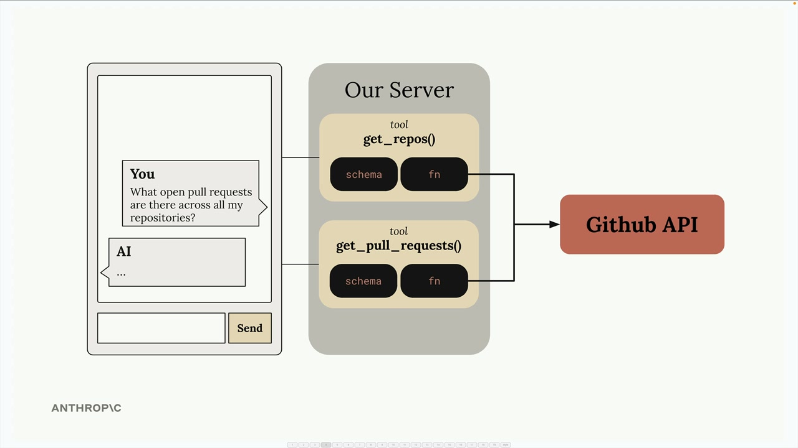
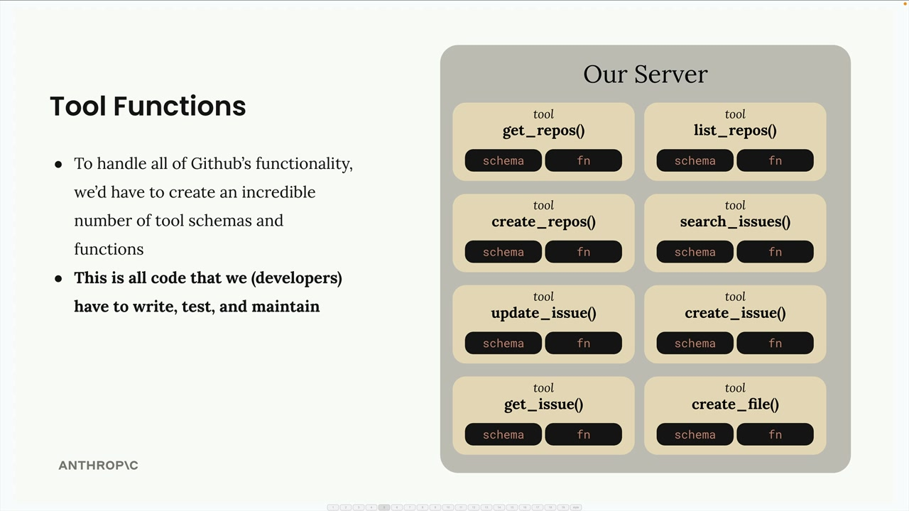
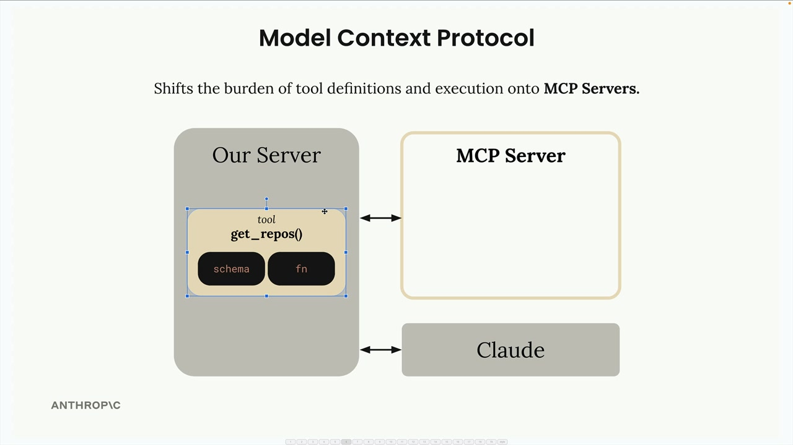
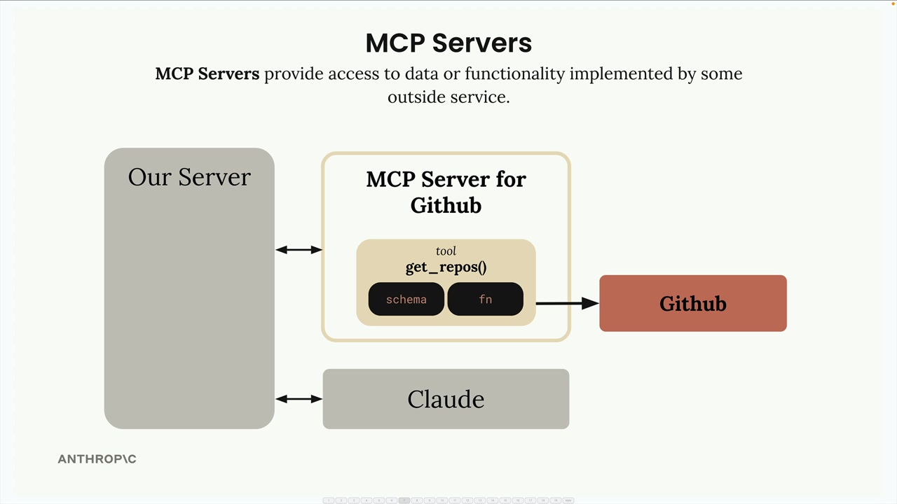

## Introducing MCP

Model Context Protocol (MCP) is a communication layer that provides Claude with context and tools without requiring you to write a bunch of tedious integration code. Think of it as a way to shift the burden of tool definitions and execution away from your server to specialized MCP servers.

### Understanding MCP Through a Real Example

Let's say you're building a chat interface where users can ask Claude about their GitHub data. A user might ask "What open pull requests are there across all my repositories?" To answer this, Claude needs tools to access GitHub's API.

### The Tool Function Problem

GitHub has massive functionality - repositories, pull requests, issues, projects, and much more. To build a complete GitHub chatbot, you'd need to author an incredible number of tools:

### How MCP Solves This

MCP shifts the burden of tool definitions and execution from your server to MCP servers. Instead of you writing all those GitHub tools, they're authored and executed inside a dedicated MCP server.

The MCP server acts as a wrapper around GitHub's functionality, providing pre-built tools that you can use without having to implement them yourself.

### Who Authors MCP Servers?
Anyone can create an MCP server implementation. Often, service providers themselves will make their own official MCP implementations. For example, AWS might release an official MCP server with tools for their various services.

### How is MCP Different from Direct API Calls?

MCP servers provide tool schemas and functions already defined for you. If you call an API directly, you're responsible for authoring those tool definitions yourself. MCP saves you that implementation work.

