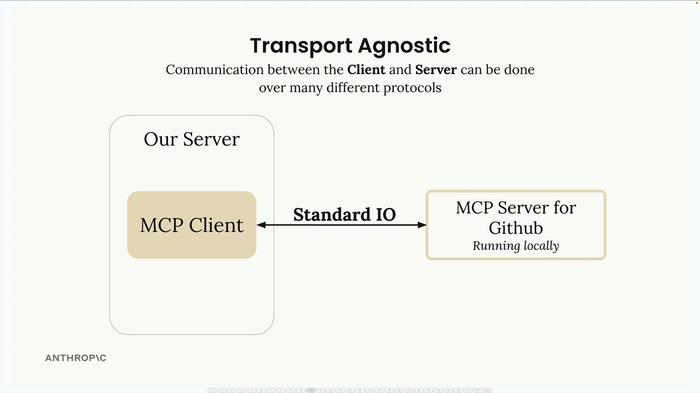
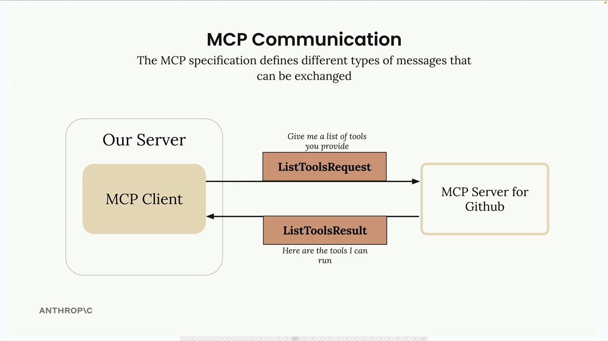
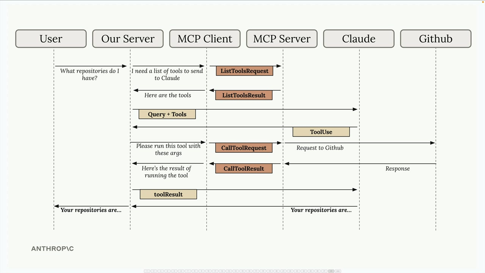

## MCP clients

The MCP client serves as the communication bridge between your server and MCP servers. Think of it as your access point to all the tools that an MCP server provides. When you need to use external tools or services, the client handles all the message passing and protocol details for you.

### Transport Agnostic Communication

One of MCP's key strengths is being transport agnostic - a fancy way of saying the client and server can talk to each other using different communication methods. The most common setup runs both the MCP client and server on the same machine, where they communicate through standard input/output.

But you're not limited to that approach. MCP clients and servers can also connect over:

- HTTP
- WebSockets
- Various other network protocols

### Message Types
Once connected, the client and server exchange specific message types defined in the MCP specification. The main message types you'll work with are:

### Complete Flow Example

