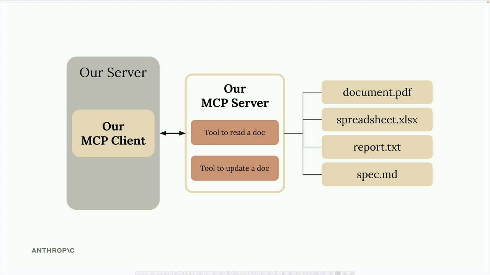

## Project Setup

We're going to build a CLI-based chatbot to better understand how MCP clients and servers work together. This hands-on project will give you practical experience with both sides of the MCP architecture.

### What We're Building

Our chatbot will allow users to interact with a collection of documents through a command-line interface. The system consists of two main components:

- An MCP client that handles user interactions
- A custom MCP server that manages document operations

