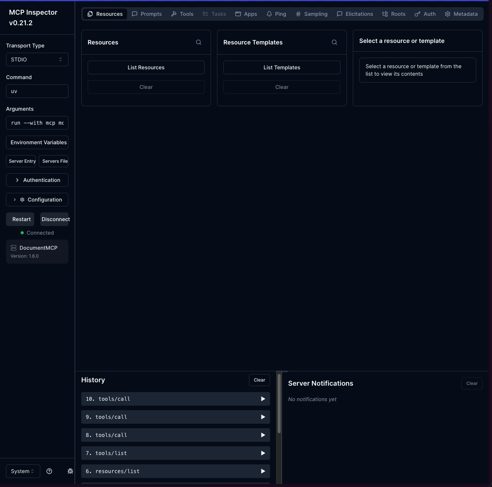
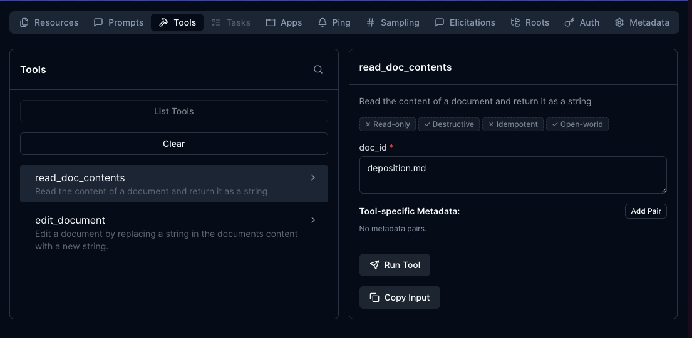
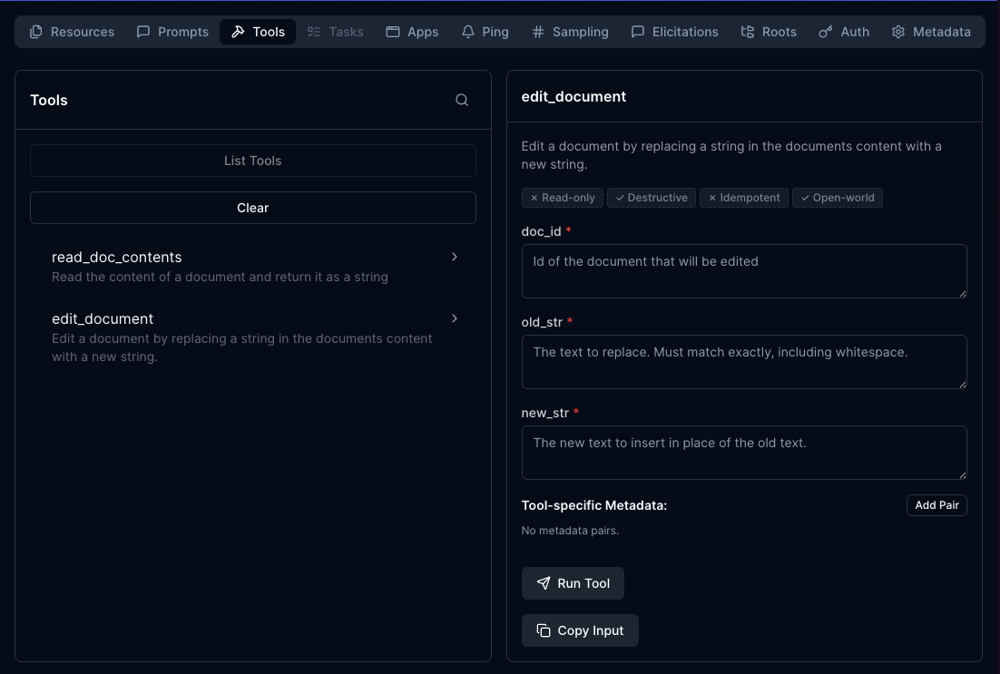

## The server inspector


### Starting the Inspector

First, make sure your Python environment is activated (check your project's README for the exact command). Then run the inspector with:

```shell
mcp dev mcp_server.py
```


- Open the inspector running locally




###  tools

Open `read_doc_contents`



The Run Tool

Open `edit_document`

update `doc_id`, `old_str` & `new_str`
for updating the content and run tool


