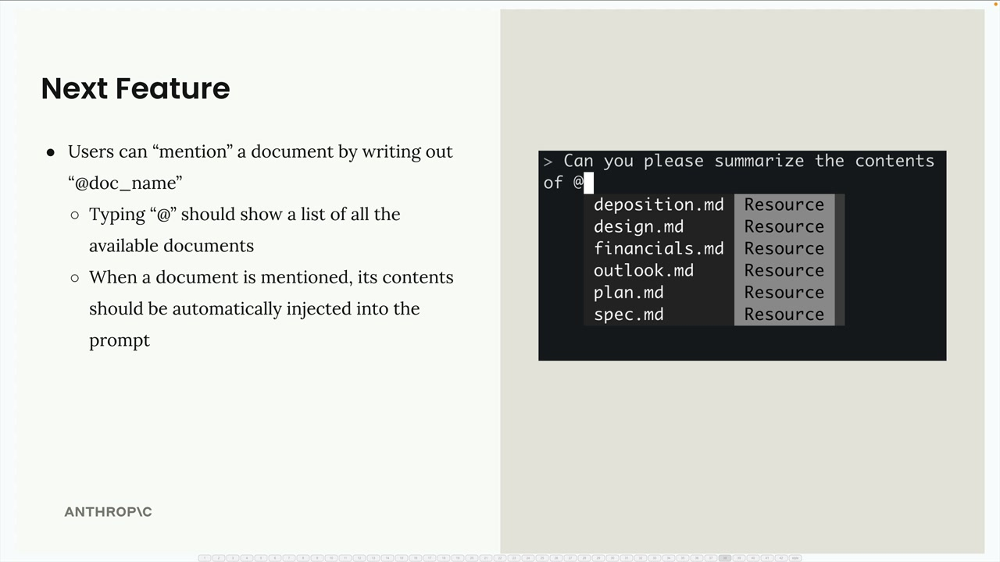
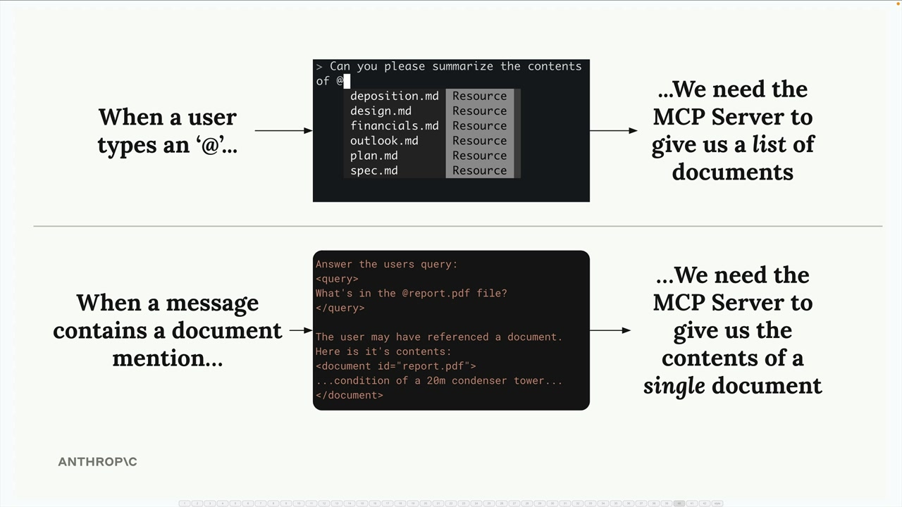
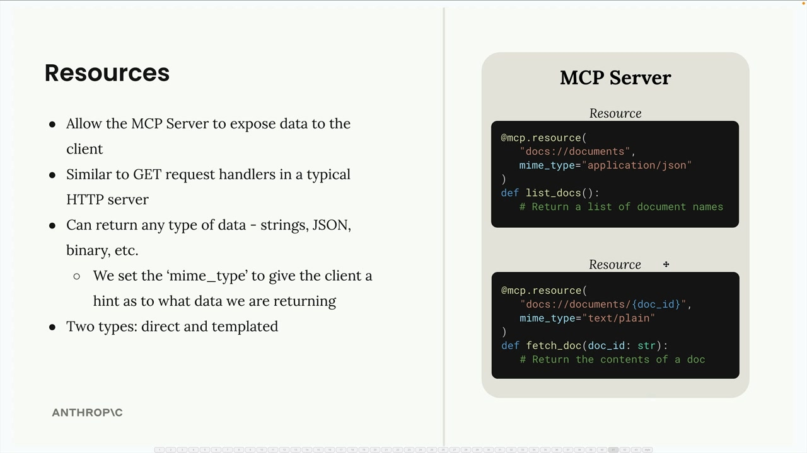
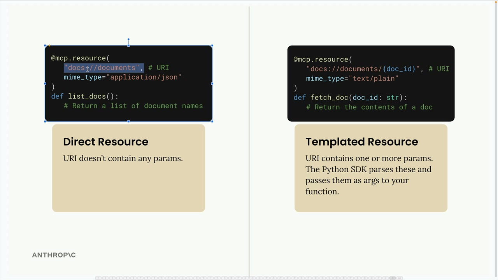

## Defining resources

### Understanding Resources Through an Example

Let's say you want to build a document mention feature where users can type @document_name to reference files. This requires two operations:

- Getting a list of all available documents (for autocomplete)
- Fetching the contents of a specific document (when mentioned)

When a user types @, you need to show available documents. When they submit a message with a mention, you automatically inject that document's content into the prompt sent to Claude.

### How Resources Work

Resources follow a request-response pattern. Your client sends a ReadResourceRequest with a URI, and the MCP server responds with the data. The URI acts like an address for the resource you want to access.

### Types of Resources

There are two types of resources:

- Direct Resources: Static URIs that don't change, like docs://documents
- Templated Resources: URIs with parameters, like docs://documents/{doc_id}