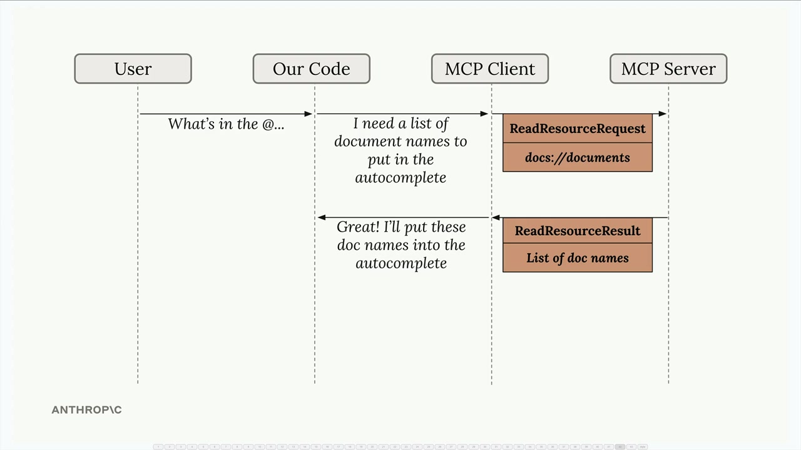

## Accessing Resources

### Understanding Resource Requests

When you've defined resources on your MCP server, your client needs a way to request and use them. The client acts as a bridge between your application and the MCP server, handling the communication and data parsing automatically.

