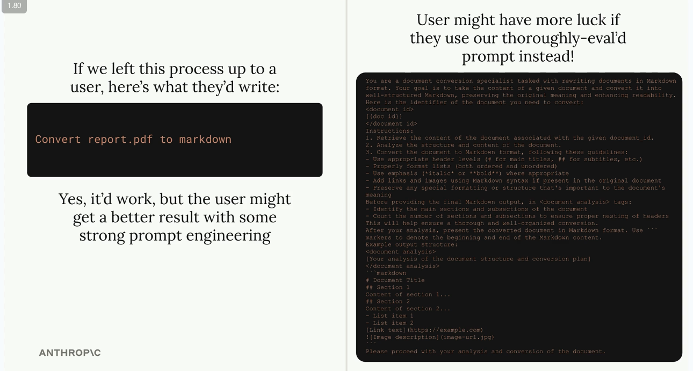
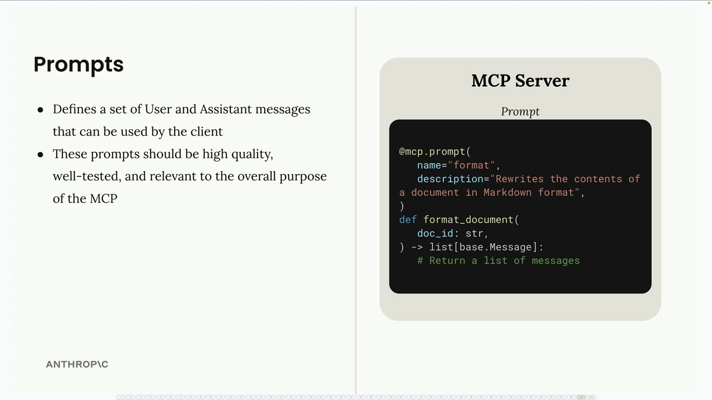

## Defining Prompts

Prompts in MCP servers let you define pre-built, high-quality instructions that clients can use instead of writing their own prompts from scratch. Think of them as carefully crafted templates that give better results than what users might come up with on their own.

### Why Use Prompts?

Let's say you want Claude to reformat a document into markdown. A user could just type "convert report.pdf to markdown" and it would work fine. But they'd probably get much better results with a thoroughly tested prompt that includes specific instructions about formatting, structure, and output requirements.

### How Prompts Work

Prompts define a set of user and assistant messages that clients can use directly. When a client requests a prompt, your server returns a list of messages that can be sent straight to Claude.

