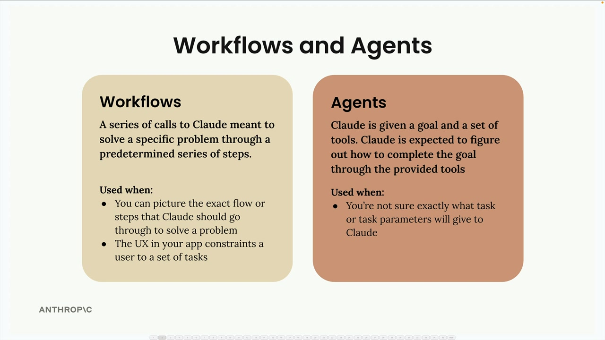
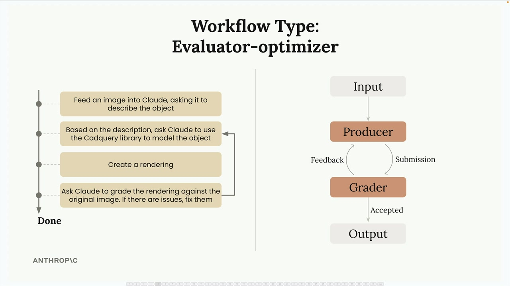

## Agents and Workflows

Workflows and agents are strategies for handling user tasks that can't be completed by Claude in a single request. You've actually been creating both throughout this course - when you used tools and let Claude figure out how to complete tasks, that was an agent.

The decision comes down to how well you understand the task:

- Use workflows when you can picture the exact flow or steps that Claude should go through to solve a problem, or when your app's UX constrains users to a set of tasks
- Use agents when you're not sure exactly what task or task parameters you'll give to Claude

Workflows are a series of calls to Claude meant to solve a specific problem through a predetermined series of steps. Agents give Claude a goal and a set of tools, expecting Claude to figure out how to complete the goal through the provided tools.

### The Evaluator-Optimizer Pattern

This modeling workflow is an example of an evaluator-optimizer pattern. Here's how it works:

- Producer: Takes input and creates output (Claude using CadQuery to model the part and create a rendering)
- Grader: Evaluates the output against some criteria
- Feedback loop: If the grader doesn't accept the output, feedback goes back to the producer for improvement
- Iteration: The cycle repeats until the grader accepts the output