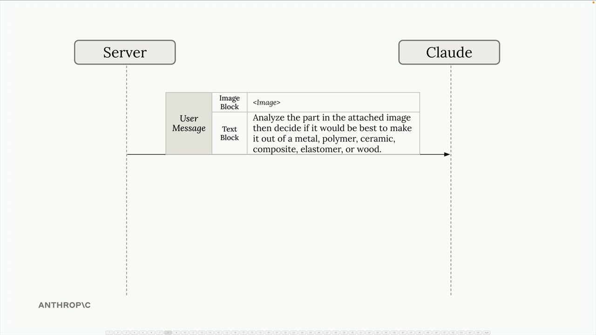
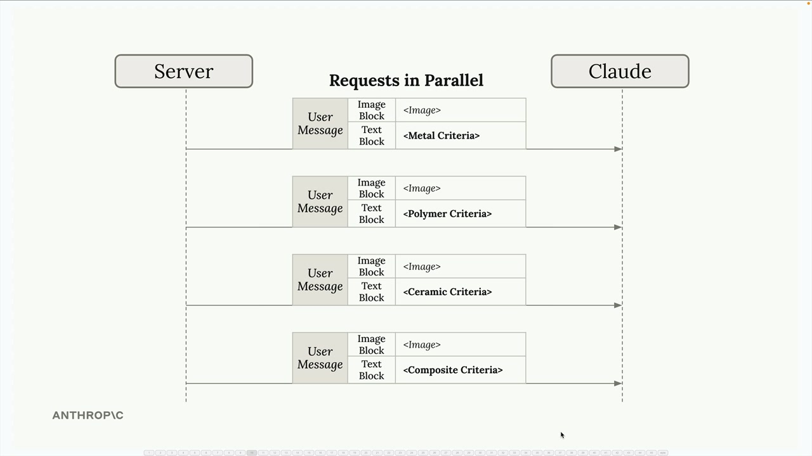
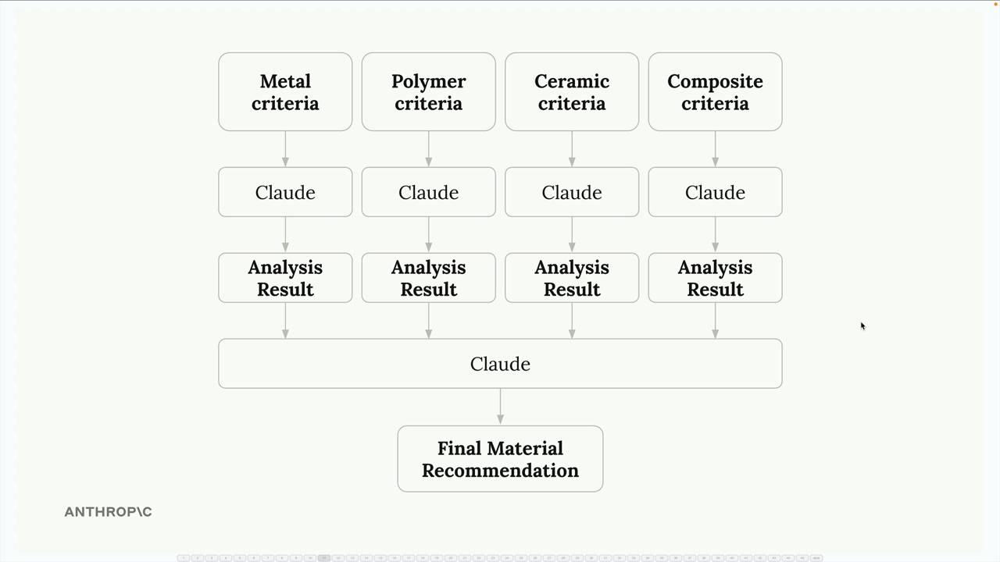
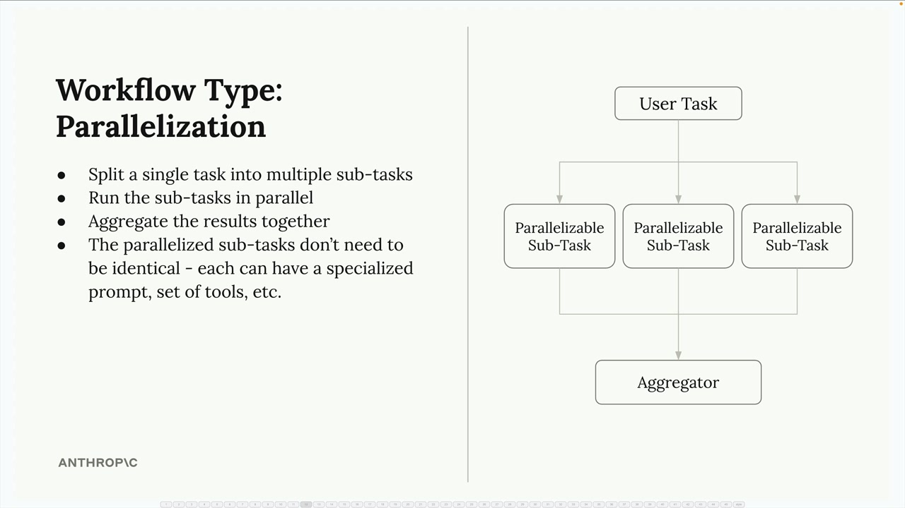

## Parallelization workflows

When building AI applications, you'll often encounter tasks that seem simple on the surface but become complex when you try to implement them effectively. Let's explore a powerful pattern called parallelization workflows that can help you break down complex tasks into manageable, focused pieces.

### The Problem with Complex Single Prompts

Imagine you're building a material designer application where users upload images of parts and receive recommendations for the best material to use. Your first instinct might be to send the image to Claude with a simple prompt asking it to choose between metal, polymer, ceramic, composite, elastomer, or wood.

### A Better Approach: Parallelization

Here's how it works:

- Send the same image to Claude multiple times simultaneously
- Each request includes specialized criteria for one material (metal criteria, polymer criteria, ceramic criteria, etc.)
- Claude evaluates the part's suitability for each material independently
- Collect all the analysis results and feed them into a final aggregation step

### How Parallelization Workflows Work

The parallelization pattern follows a simple structure:

- Split a single task into multiple sub-tasks - Break down the complex decision into focused, specialized evaluations
- Run the sub-tasks in parallel - Execute all evaluations simultaneously for faster processing
- Aggregate the results together - Combine the specialized analyses into a final decision
- The parallelized sub-tasks don't need to be identical - Each can have a specialized prompt, set of tools, or evaluation criteria