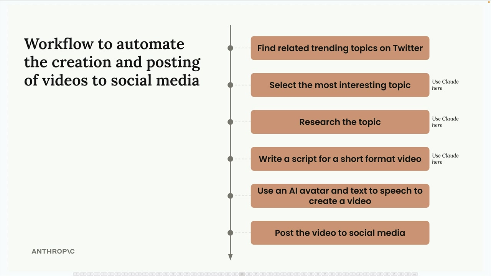
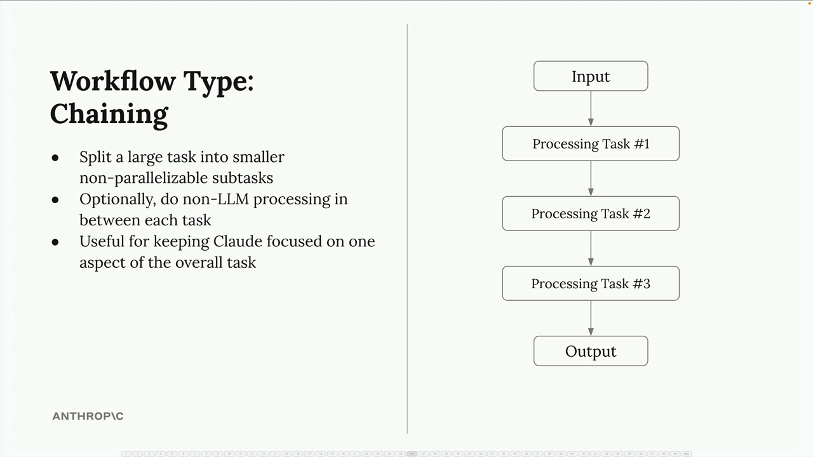
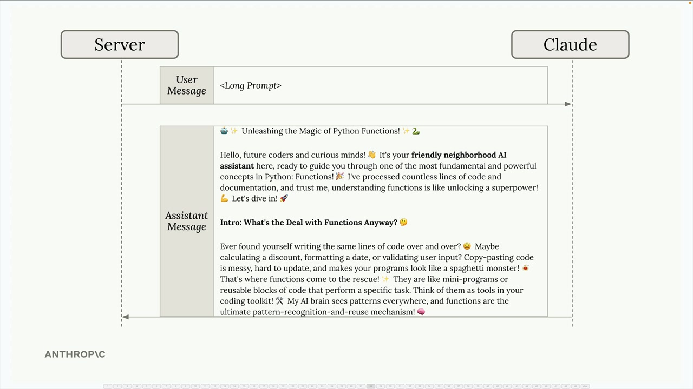
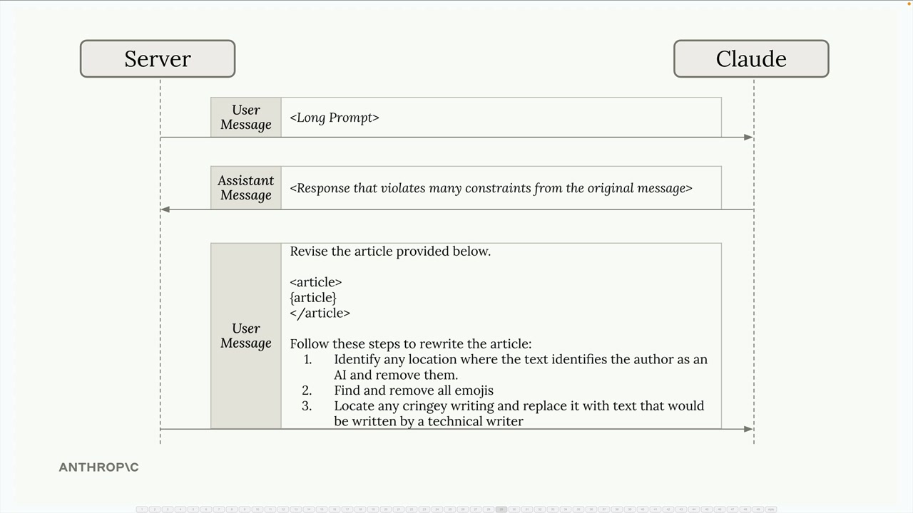

## Chaining workflows

### What is Workflow Chaining?

A chaining workflow breaks down a large, complex task into smaller, sequential subtasks. Instead of asking Claude to do everything at once, you split the work into focused steps that build on each other.

Here's a practical example: imagine you're building a social media marketing tool that creates and posts videos automatically. Rather than asking Claude to handle everything in one massive prompt, you could break it down like this:

- Find related trending topics on Twitter
- Select the most interesting topic (using Claude)
- Research the topic (using Claude)
- Write a script for a short format video (using Claude)
- Use an AI avatar and text-to-speech to create a video
- Post the video to social media

### The Chaining Solution

Instead of fighting with one massive prompt, use a two-step chaining approach:

Step 1: Send your initial prompt and accept that the first result might not be perfect. Claude will generate an article, but it might violate some of your constraints.

Step 2: Make a follow-up request that focuses specifically on fixing the issues. Provide the article Claude just wrote and give it targeted revision instructions:

