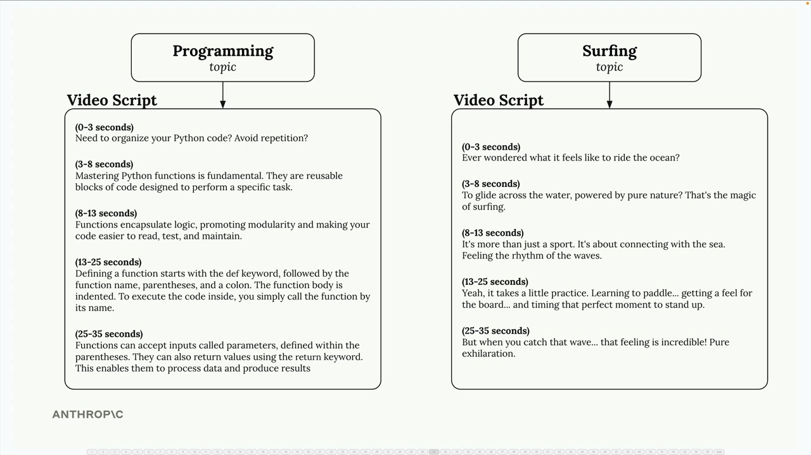
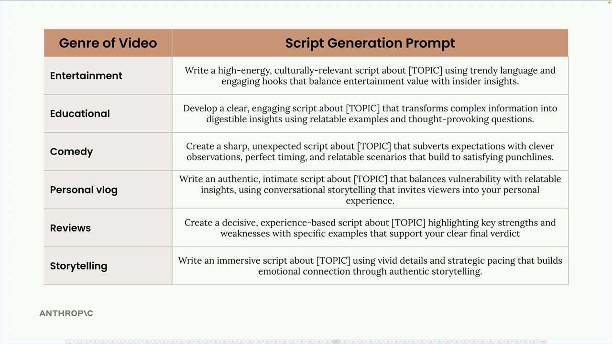
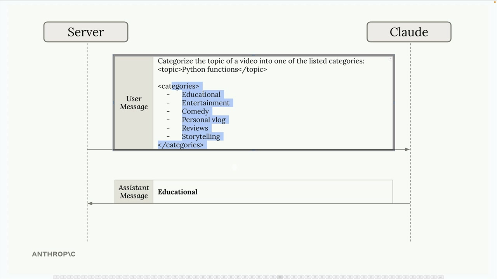
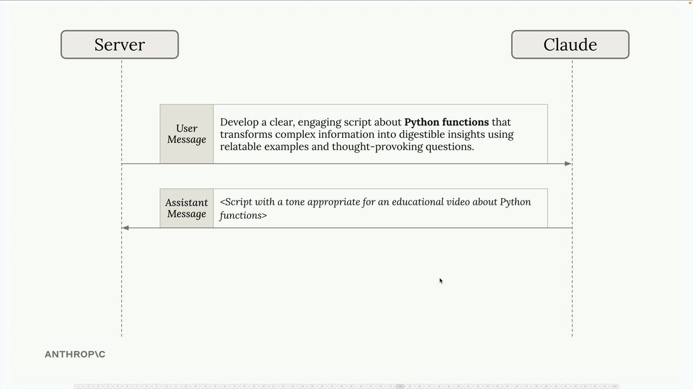
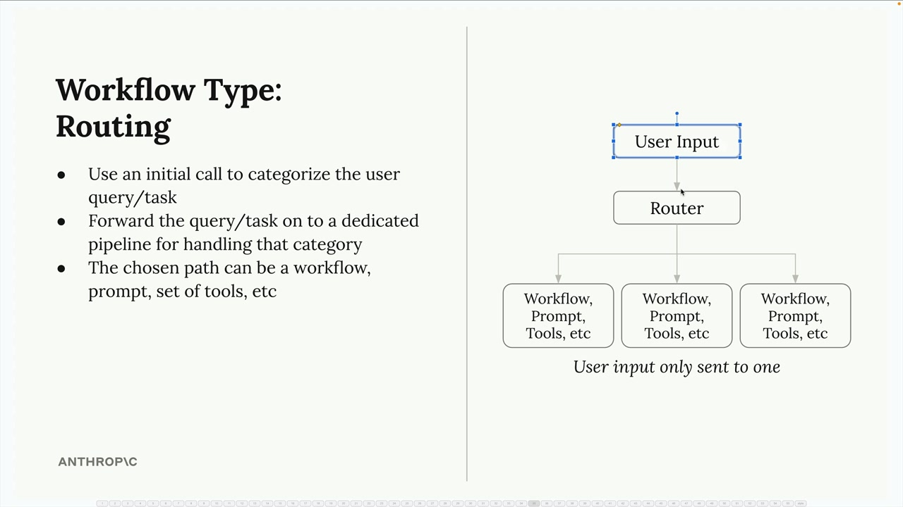

## Routing workflows

Routing workflows solve a common problem in AI applications: different types of user requests need different handling approaches. Instead of using a one-size-fits-all prompt, you can categorize incoming requests and route them to specialized processing pipelines.

### The Problem with Generic Prompts

Consider a social media marketing tool that generates video scripts from user topics. A user might enter "programming" or "surfing" as their topic, but these should produce very different types of content:



### Setting Up Content Categories

The first step is defining the different types of content your application might need to generate. You might categorize requests into genres like:

- Entertainment - High-energy, culturally relevant content with trendy language
- Educational - Clear, engaging explanations with relatable examples
- Comedy - Sharp, unexpected content with clever observations and timing
- Personal vlog - Authentic, intimate content with conversational storytelling
- Reviews - Decisive, experience-based content highlighting strengths and weaknesses
- Storytelling - Immersive content using vivid details and emotional connection



### How Routing Works in Practice

The routing process happens in two steps:

- Categorization - Send the user's topic to Claude with a request to categorize it into one of your predefined genres
- Specialized Processing - Use the category result to select the appropriate prompt template and generate content



For example, if a user enters "Python functions" as their topic, you'd first ask Claude to categorize it:

```
Categorize the topic of a video into one of the listed categories:
<topic>Python functions</topic>

<categories>
- Educational
- Entertainment  
- Comedy
- Personal vlog
- Reviews
- Storytelling
</categories>
```

Claude responds with "Educational", so you then use the educational prompt template to generate the actual script content.



### Routing Workflow Architecture



- User input goes to a router component first
- The router categorizes the request using an initial Claude call
- Based on the category, the input gets forwarded to one specific processing pipeline
- Each pipeline can have its own workflow, prompts, or tools optimized for that category


### When to Use Routing

Routing workflows work well when:

- Your application handles diverse types of requests that need different approaches
- You can clearly define categories that cover your use cases
- The categorization step can be handled reliably by Claude
- The performance benefit of specialized processing outweighs the overhead of the routing step
