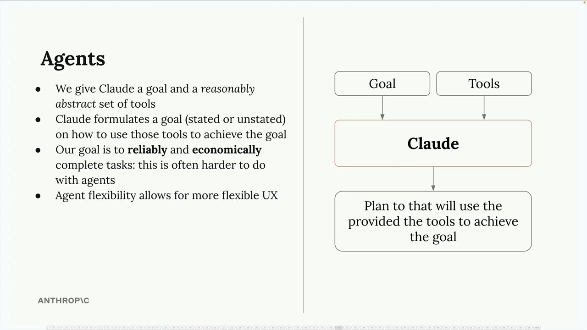
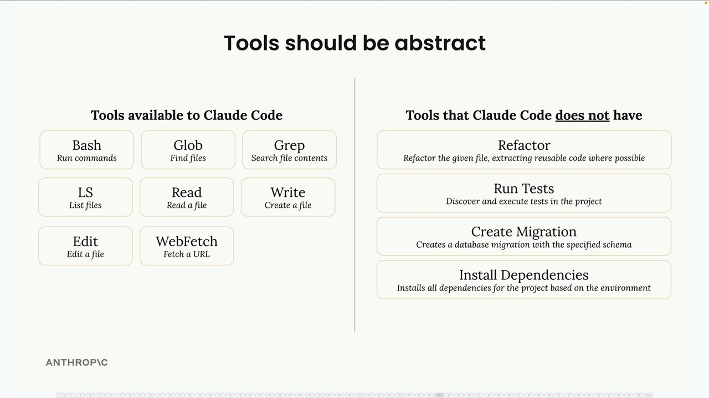
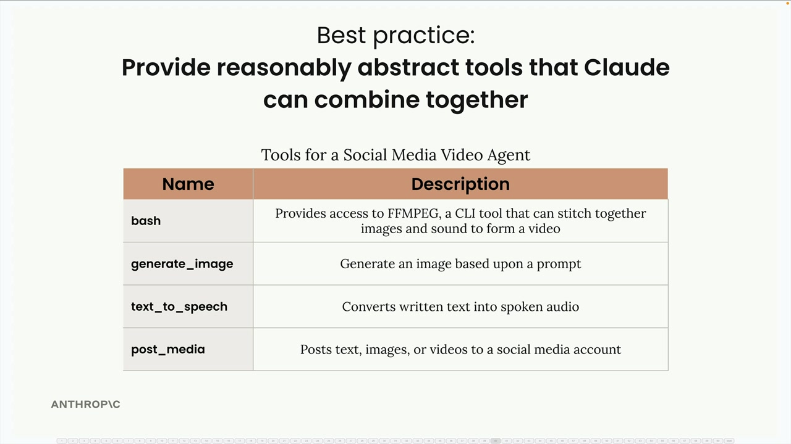

## Agents and tools

Agents represent a shift from the structured workflows we've been working with. While workflows are perfect when you know the exact steps needed to complete a task, agents shine when you're not sure what those steps should be. Instead of defining a rigid sequence, you give Claude a goal and a set of tools, then let it figure out how to combine those tools to achieve the objective.

### Tools Should Be Abstract

The key insight for building effective agents is providing reasonably abstract tools rather than hyper-specialized ones. Claude Code demonstrates this principle perfectly.

Claude Code has access to generic, flexible tools like:

- bash - Run any command
- read - Read any file
- write - Create any file
- edit - Modify files
- glob - Find files
- grep - Search file contents

It notably doesn't have specialized tools like "refactor code" or "install dependencies." Instead, Claude figures out how to use the basic tools to accomplish these complex tasks. This abstraction allows it to handle countless programming scenarios that the developers never explicitly planned for.

### Best Practice: Combinable Tools

When designing agents, provide tools that Claude can combine in creative ways. For example, a social media video agent might include:

