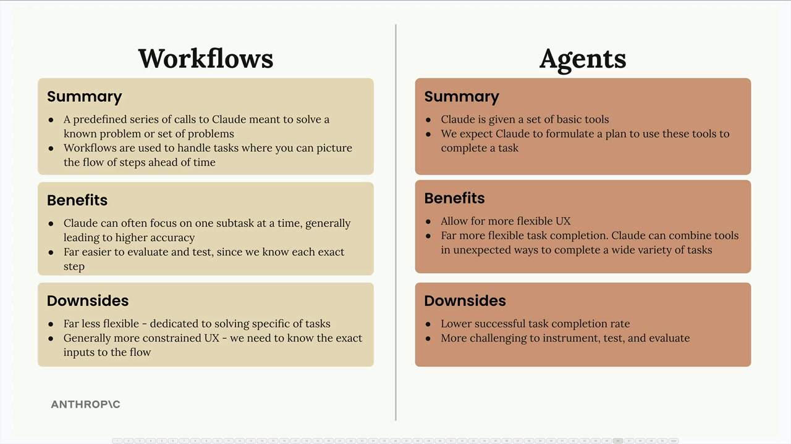

## Workflows vs Agents

When building AI-powered applications, you'll often need to choose between two different architectural approaches: workflows and agents. Each has distinct advantages and trade-offs that make them suitable for different scenarios.

